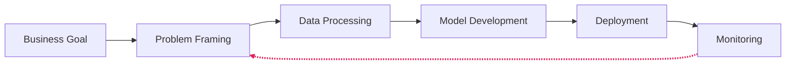
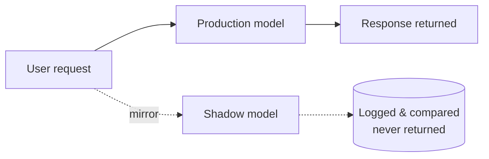
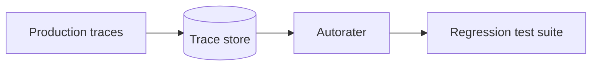
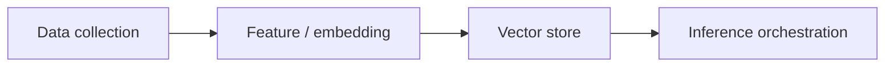
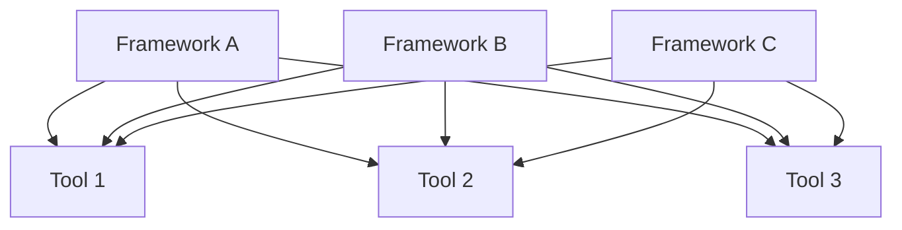
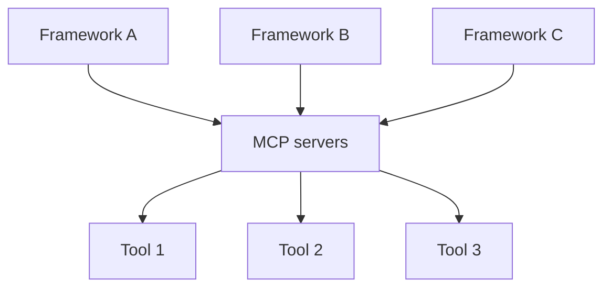

<!--
Hold 15s while people settle. Don't read the title out loud — say hello, thank them for coming.
-->

---
layout: quote
dark: true
---

How many of you have shipped an AI demo that quietly died?

<!--
Hold 20-30s. Wait for hands. Emotional entry point. "Yeah. Me too. More than once."
-->

---
layout: stats
stats:
  - value: "80%+"
    label: "of AI projects fail — twice the rate of conventional IT"
    caption: "RAND, 2024. 65 practitioner interviews — citing an outside estimate."
---

<!--
Hold 30s. Say the number slow, then repeat it once. Don't editorialize — the number does the work. If challenged on precision: this is qualitative research, 65 experienced practitioners interviewed, and RAND itself is citing "by some estimates" — not a number RAND computed from a large sample. Round numbers from real methodology beat fake precision.
-->

---
layout: stats
title: "Two more studies"
stats:
  - value: "95%"
    label: "of GenAI pilots show no measurable P&L return"
    caption: "MIT Project NANDA, 2025. Preliminary, not peer-reviewed."
  - value: "28%"
    label: "of AI use cases in infrastructure & operations meet ROI expectations"
    caption: "Gartner, April 2026. 782 I&O leaders."
---

<!--
Hold 45s. Credibility beat. NANDA's report is explicitly preliminary and hasn't been peer-reviewed — worth flagging if anyone asks. Gartner's 28% is scoped specifically to infrastructure & operations use cases, not enterprise AI broadly — keep that scope precise. "Three independent studies, same conclusion." CUT CANDIDATE if pacing runs long — slide 3 alone carries the number.
-->

---
layout: comparison
title: "Where the failure actually is"
left:
  title: "The notebook"
  points:
    - "model.fit() converges"
    - "Accuracy looks great on the holdout set"
    - "Demo day: it works"
right:
  title: "The system around it"
  points:
    - "Data pipeline — unowned, undocumented"
    - "Identity boundary — nobody drew it"
    - "Observability — bolted on after the incident"
    - "Cost line — nobody modeled it"
---

<!--
ANCHOR: "The model is 10 percent. The other 90 percent is what killed the project." It's almost never the model that failed — the model usually worked fine.
-->

---
layout: quote
dark: true
---

AI is software with new rules.

<!--
No decoration. Say the line. Pause. This is the throughline for everything after: non-deterministic output, data-dependent behavior, model drift, an inverted cost model.
-->

---
layout: agenda
items:
  - "The prototype graveyard"
  - "Lifecycle, Well-Architected, regulation"
  - "Shipping non-deterministic code"
  - "Grounding models in your data"
  - "Agents, and the protocol that made them portable"
  - "Identity, observability, cost"
---

<!--
Over the next 35 minutes: the lifecycle and where regulation now fits into it, safe rollout strategies that account for non-determinism, the shift from classic RAG to managed knowledge planes, multi-agent orchestration and the protocol (MCP) that made it interoperable, and the identity, observability, and compliance model that makes any of this work in an enterprise. You'll leave with a blueprint you can take back Monday morning.
-->

---
layout: default
title: "The six-phase lifecycle"
---

# The six-phase lifecycle

<div flex justify-center mt-4>



</div>

<!--
Say: "This isn't waterfall. It isn't even agile. It's a feedback loop with a clock on it." The red arrow — Monitoring back to Problem Framing — is the whole point of this slide. The moment you stop iterating, your model starts decaying.
-->

---
layout: timeline
title: "Use-case drift"
events:
  - date: "Week 1"
    label: "\"Reduce complaints by 30%\""
  - date: "Month 3"
    label: "Which vector database?"
  - date: "Month 6"
    label: "Nobody mentions complaints anymore"
    detail: "One of RAND's five root causes: stakeholders miscommunicating the problem"
---

<!--
Hold 30s. Uncomfortable laughs land here. That's the point.
-->

---
layout: default
title: "Well-Architected, for AI"
---

# Well-Architected, for AI

<div grid="~ cols-3 gap-6" mt-4>
<div><strong>Operational Excellence</strong><br>MLOps automation</div>
<div><strong>Security</strong><br>Model, data, prompt</div>
<div><strong>Reliability</strong><br>Recovery from drift</div>
<div><strong>Performance</strong><br>Purpose-built silicon</div>
<div><strong>Cost</strong><br>Inference is your bill</div>
<div><strong>Sustainability</strong><br>Measurable now</div>
</div>

<p text-sm opacity-70 mt-8>AWS ML Lens · GCP AI/ML Framework · Azure Well-Architected AI workload guidance</p>

<!--
Sustainability is worth a beat — training and inference at scale have real, now-measurable environmental cost.
-->

---
layout: default
title: "Convergence"
---

# Three competitors. Same six answers.

<div grid="~ cols-3 gap-6" mt-8 text-center text-xl>
<div><strong>AWS</strong></div>
<div><strong>GCP</strong></div>
<div><strong>Azure</strong></div>
</div>

<p mt-8 text-center>All three arrived at the same six Well-Architected pillars — independently.</p>

<p text-sm opacity-70 mt-4 text-center>AWS ML Lens · GCP AI/ML Framework · Azure Well-Architected AI workload guidance</p>

<!--
Hold 20s. Credibility beat for the entire talk. ANCHOR: "When three competitors converge on the same six pillars, that's not marketing. That's emerging engineering truth."
-->

---
layout: quote
dark: true
---

Regulation is an architectural input now. Not a Phase-6 checkbox.

<!--
Hold. Let it land.
-->

---
layout: default
title: "The clock"
---

# The EU AI Act. Two dates, not one.

<div grid="~ cols-2 gap-8" mt-6>
<div>

**August 2, 2026**
- Article 50 transparency obligations
- GPAI penalty powers
- Fines up to €15M or 3% of global revenue

Enforceable <WeeksSince date="2026-08-02" />

</div>
<div>

**December 2, 2027**
- High-risk regime
- Human-in-the-loop checkpoints
- Risk classification, conformity assessment

Delayed 16 months — Digital Omnibus, May 2026

</div>
</div>

<p text-sm opacity-70 mt-8>Source: EU AI Act (Regulation (EU) 2024/1689); Digital Omnibus package, May 2026</p>

<!--
The deadline is real, it's just narrower than the headlines made it sound — and the big one just moved. €35M/7% is real too, but it's the Act's top tier, reserved for prohibited practices, not the transparency rules landing here. Human-in-the-loop and risk classification got sixteen months of runway via the Digital Omnibus — that's not a reason to ignore them, it's more time to build them properly instead of bolting them on under deadline pressure. Know one real Article 50 enforcement case to reference.
-->

---
layout: default
title: "Standards, not just regulations"
---

# Standards, not just regulations

<div grid="~ cols-3 gap-6" mt-8 text-center text-lg>
<div><strong>EU AI Act</strong></div>
<div><strong>NIST AI RMF</strong></div>
<div><strong>ISO/IEC 42001</strong></div>
</div>

<p mt-8 text-center>Buy, build, or hybrid. Same controls. Same paper trail.</p>

<!--
CUT CANDIDATE — slide 12 does most of the work.
-->

---
layout: section
number: "03"
title: "Shipping non-deterministic code"
hide: true
---

<!--
Hold 5s. Move on.
-->

---
layout: comparison
title: "The core problem"
left:
  title: "A unit test"
  points:
    - "Same input →"
    - "one deterministic output"
    - "Pass or fail"
right:
  title: "The same test, against an LLM"
  points:
    - "Same input →"
    - "three different outputs, three runs"
    - "\"Correct\" isn't pass or fail"
---

<!--
ANCHOR (crisp, don't add anything after): "Correct isn't a value. It's a distribution."
-->

---
layout: default
title: "Four patterns, one slide"
---

# Four patterns, one slide

<div grid="~ cols-2 gap-6" mt-4>
<div><strong>Blue-Green</strong><br>Fast rollback, trust your validation</div>
<div><strong>Canary</strong><br>Gradual, real-user exposure</div>
<div><strong>Shadow</strong><br>Mirror traffic, discard results</div>
<div><strong>A/B Testing</strong><br>Prove business impact</div>
</div>

<!--
Hold 45s. "Read while I narrate" slide.
-->

---
layout: default
title: "Shadow deployment, in detail"
---

# Shadow deployment, in detail

<div flex justify-center mt-4>



</div>

<v-clicks>

- Build 1 — production path only
- Build 2 — shadow duplication added
- Build 3 — comparison and diff, labeled

</v-clicks>

<!--
Highest-value technical slide of the talk. ANCHOR: "The number of production AI incidents I've seen that would have been caught by a two-week shadow run is depressing." If the venue projector is bad, skip the clicks and present the finished diagram — it's static either way, no risk.
-->

---
layout: process
title: "The Azure template"
steps:
  - title: "Deploy green"
    detail: "0% traffic"
  - title: "Smoke test"
    detail: "Invoke green by name"
  - title: "Mirror"
    detail: "Live traffic duplicated"
  - title: "Progressive shift"
    detail: "10% → 25% → 50% → 100%"
  - title: "Retire blue"
---

<!--
Say: "Names change per cloud. Shape doesn't."
-->

---
layout: default
title: "Trace-based eval"
---

# Trace-based eval

<div flex justify-center mt-4>



</div>

<p text-sm opacity-70 mt-4>AgentCore Evaluations (GA June 17, 2026, AWS Summit New York) · Foundry trace-based evaluation · Agent Evaluation on Agent Platform</p>

<!--
CUT CANDIDATE — nice-to-have callout, not core. Say: "Your shadow observations become your eval set. Automatically."
-->

---
layout: process
title: "The sequence"
steps:
  - title: "Shadow"
    detail: "Tells you whether the model is broken"
  - title: "Canary"
    detail: "Tells you whether users tolerate it"
  - title: "Full cutover"
---

<!--
ANCHOR (pause between sentences): "Shadow tells you whether the model is broken. Canary tells you whether users tolerate it. You need both answers." Source note: delivery notes elsewhere group this slide with the full-bleed statement slides — if you'd rather deliver it that way, swap to `layout: quote` + `dark: true` with the same line as body text.
-->

---
layout: quote
---

If shadow isn't in your pipeline, that's your highest-leverage fix.

<!--
Section landing.
-->

---
layout: section
number: "04"
title: "Grounding models in your data"
hide: true
---

---
layout: default
title: "Why RAG exists"
---

# Why RAG exists

<v-clicks>

- Foundation models hallucinate
- Foundation models are frozen at training cutoff
- Foundation models don't know your company

</v-clicks>

<p mt-6 v-click><strong>RAG solves all three.</strong></p>

<!--
CUT CANDIDATE — most of the room knows why RAG exists. "Same model. Dramatically better answers."
-->

---
layout: default
title: "Four pipelines, one shape"
---

# Four pipelines, one shape

<div flex justify-center mt-4>



</div>

| | AWS | GCP | Azure |
|---|---|---|---|
| Collection & storage | S3 | Cloud Storage | Blob Storage |
| Embedding & retrieval | OpenSearch | Vertex AI (Agent Platform) | Azure AI Search |

<!--
Say: "Same shape everywhere. Different plumbing."
-->

---
layout: comparison
title: "The managed-knowledge shift"
left:
  title: "2024"
  points:
    - "A dev, staring at the four-pipeline diagram"
    - "Custom code, everywhere"
right:
  title: "2026"
  points:
    - "The same dev"
    - "One box: managed knowledge base"
    - "Bedrock Managed KB (AWS Summit NY, Jun 2026) · Foundry IQ (Build 2026) · GCP RAG Engine"
---

<!--
"You probably shouldn't be hand-rolling the four-pipeline architecture anymore."
-->

---
layout: comparison
title: "Classic vs. agentic retrieval"
left:
  title: "Classic RAG"
  points:
    - "Query: one vector search"
    - "Sources: one"
    - "Latency: fast"
    - "Cost: cheap"
    - "Best for: FAQ, refunds, policy lookup"
right:
  title: "Agentic retrieval"
  points:
    - "Query: LLM decomposes to sub-queries"
    - "Sources: many, parallel"
    - "Latency: slow"
    - "Cost: expensive"
    - "Best for: complex, multi-source, conversational"
---

<!--
The trade-off is still real. Pick deliberately, don't over-engineer.
-->

---
layout: default
title: "The default has flipped"
---

# The default has flipped

In 2026, agentic retrieval ships natively on all three clouds.

Classic RAG is still the right answer more often than teams think.

<p text-sm opacity-70 mt-6>Per each platform's current product docs — Bedrock, Foundry IQ, RAG Engine</p>

<!--
ANCHOR: "A surprising number of teams default to agentic because it sounds sophisticated, then wonder why latency is four seconds and the bill tripled."
-->

---
layout: quote
dark: true
---

When the agent retrieves, who is it acting as?

<!--
Hold. Seed for Section VI.
-->

---
layout: quote
---

Pick your RAG shape deliberately. Managed unless you have a real reason.

<!--
Section landing.
-->

---
layout: section
number: "05"
title: "Agents. And the protocol that made them portable."
hide: true
---

<!--
Densest section. Do not rush.
-->

---
layout: comparison
title: "What is an agent, actually"
left:
  title: "Model + tool"
  points:
    - "Input → arrow → output"
    - "Not an agent"
right:
  title: "Model in a loop"
  points:
    - "Tools, observations feeding back"
    - "Agent"
---

<!--
"A calculator function bolted to GPT isn't an agent. A loop is."
-->

---
layout: default
title: "New failure modes"
---

# New failure modes

<v-clicks>

- Infinite loops
- Wrong tool called
- Hallucinated tool
- Correct tool, wrong argument
- Correct result, misinterpreted

</v-clicks>

<!--
Deliberately ugly and long. "None of these existed in request-response. All of them exist now."
-->

---
layout: default
title: "MCP: the setup"
---

# MCP: the setup

<div grid="~ cols-2 gap-8" mt-4>
<div flex="~ col" items-center>

**Before**



</div>
<div flex="~ col" items-center>

**After**



</div>
</div>

<p text-sm opacity-70 mt-4>Model Context Protocol. Anthropic, November 2024. Open standard.</p>

<!--
"USB-C for agents." Pause after "agents" — the metaphor lands better with space around it.
-->

---
layout: stats
title: "MCP: the numbers"
stats:
  - value: "10,000+"
    label: "Public MCP servers"
    caption: "Anthropic's own figure, December 2025"
  - value: "5"
    label: "Vendors shipping native support"
    caption: "Per each vendor's own product announcements"
  - value: "Dec 2025"
    label: "Donated to the Agentic AI Foundation"
    caption: "Anthropic's donation announcement, Dec 2025"
  - value: "07-28"
    label: "Largest spec revision since launch"
    caption: "Per a third-party MCP version tracker, 2026"
---

<!--
ANCHOR: "Tools are portable now. That's the new thing." Read the numbers cleanly, don't editorialize. You'll see bigger numbers floating around online — download counts in the tens of millions, Fortune 500 adoption anywhere from 28 to 80 percent depending which blog you land on. Treat those skeptically; nobody's independently measuring this well yet, and the spread between sources tells you that. What's not in dispute is the vendor list and the governance move to the Linux Foundation. That's the real signal.
-->

---
layout: default
title: "Six orchestration patterns"
---

# Six orchestration patterns

<div grid="~ cols-3 gap-6" mt-4 text-sm>
<div><strong>Sequential</strong><br>Structured pipelines</div>
<div><strong>Routing</strong><br>Clear category dispatch</div>
<div><strong>Parallel</strong><br>Latency reduction, diverse perspectives</div>
<div><strong>ReAct</strong><br>Tool use, iterative</div>
<div><strong>Hierarchical (Magentic)</strong><br>Open-ended tasks</div>
<div><strong>Evaluator</strong><br>Quality-critical outputs</div>
</div>

<p text-sm opacity-70 mt-4>Magentic-One: Microsoft Research</p>

<!--
Hold 60s. "Read while I narrate" slide. Do not walk through each tile — narrate the meta-point.
-->

---
layout: default
title: "Runtime landscape, current state"
---

# Runtime landscape, current state

<div grid="~ cols-3 gap-6" mt-4>
<div>

**AWS AgentCore**
GA Oct 2025. Policy, Evaluations, and managed harness all GA June 17, 2026 (AWS Summit NY). Payments (Coinbase, Stripe) announced.

</div>
<div>

**GCP Agent Platform**
Announced Cloud Next '26. Vertex retired. Skill Registry. Memory Bank profiles GA.

</div>
<div>

**Microsoft Foundry**
Agent Framework 1.0 GA. Foundry Agent Service GA. Hosted Agents targeted GA early July 2026. M365 publishing.

</div>
</div>

<p mt-8 text-center><strong>All three are GA. Pick on other criteria.</strong></p>

<p text-sm opacity-70 mt-2 text-center>AWS Summit New York, June 2026 · Google Cloud Next '26 · Microsoft Build 2026</p>

<!--
AWS Bedrock AgentCore went GA in October 2025. AgentCore Policy, AgentCore Evaluations, and the managed harness all reached GA at AWS Summit New York on June 17, 2026. It's framework-agnostic — bring your LangGraph, CrewAI, Claude Agent SDK, custom Python. Policies are written in Cedar and run outside your agent code. AWS has also talked publicly about AgentCore Payments — Coinbase and Stripe integration — but double-check the exact GA status closer to your delivery date, since it hasn't been independently reconfirmed. GCP's Gemini Enterprise Agent Platform was announced at Cloud Next in late April 2026; Vertex AI as a standalone brand was retired, its capabilities folded in as sub-features. Microsoft Agent Framework 1.0 went GA in April, consolidating Semantic Kernel and AutoGen. Foundry Agent Service is GA. Hosted agents were a target, not a confirmed shipment, as of Build 2026 — say "targeted for" unless you can confirm the actual GA announcement closer to delivery. Bottom line: all three are GA. Pick on other criteria.
-->

---
layout: default
title: "Cross-vendor reality"
---

# Cross-vendor reality

| Model | AWS | GCP | Azure |
|---|---|---|---|
| Claude | native, Bedrock | available, Model Garden | GA June 29, 2026 |
| GPT | increasingly available | | primary, expanding |
| Gemini | | primary | cross-cloud emerging |
| Open models | everywhere | everywhere | everywhere |

<p mt-6 opacity-80>The frontier models have converged closely on most public benchmarks. The platform gap on governance is the more durable one.</p>

<p text-sm opacity-70 mt-2>Claude on Microsoft Foundry: Microsoft & Anthropic, June 29, 2026</p>

<!--
Claude went GA on Microsoft Foundry June 29, 2026 — confirmed by Microsoft's own devblog and Anthropic's announcement. Say: "Look at what's now true. Claude runs on all three. GPT is increasingly cross-platform. Gemini's in Model Garden. LangGraph and CrewAI run on every platform. MCP tools work across all runtimes. The patterns are portable. The models are portable. The tools are portable. So what's left? Governance. Identity. Data gravity. That's what actually differentiates the platforms now."
-->

---
layout: quote
dark: true
---

In 2026, agents run everywhere. What varies is who they answer to.

<!--
TOP 5 — highest-value line in the updated talk. Hold 20s. No commentary. If you flub any line in the whole deck, don't let it be this one.
-->

---
layout: default
title: "A2A + AP2"
---

# A2A + AP2

Two agents, different organizations, talking directly.

- **A2A** — agent-to-agent
- **AP2** — agent payments

Watch this space.

<p text-sm opacity-70 mt-4>A2A and AP2: Google, open protocols</p>

<!--
CUT CANDIDATE — drop without losing the argument. "If you're building anything that crosses org boundaries, these are the standards to track."
-->

---
layout: section
number: "06"
title: "The part that determines your platform choice"
hide: true
---

---
layout: comparison
title: "The two identity patterns"
left:
  title: "Identity passthrough"
  points:
    - "Microsoft Foundry + Fabric"
    - "User's Entra token flows through the agent"
    - "Agent inherits the human"
right:
  title: "Runtime isolation"
  points:
    - "GCP Agent Identity"
    - "SPIFFE cert bound to container, mTLS everywhere"
    - "Agent has its own identity, tied to where it runs"
---

<!--
"Human-driven workflows on the left. Autonomous workflows on the right. You probably need both."
-->

---
layout: code-focus
title: "OpenTelemetry GenAI conventions"
---

```yaml
gen_ai.system: "anthropic"
gen_ai.request.model: "claude-opus-5"
gen_ai.usage.input_tokens: 1834
gen_ai.usage.output_tokens: 412
gen_ai.tool.name: "search_knowledge_base"
gen_ai.server.time_to_first_token: 0.312
```

Datadog · Honeycomb · Grafana · LangChain · CrewAI · AutoGen

**The de facto standard. Not yet formally Stable.**

<p text-sm opacity-70>As of July 2026 — OpenTelemetry GenAI semantic conventions, Development status</p>

<!--
ANCHOR: "Real and worth adopting. Not yet finished." No GenAI span, event, metric, or attribute is marked Stable — the conventions moved to their own dedicated repository in 2026 and remain in Development status there, meaning the schema itself is still allowed to change. What is true: broad practical tooling support exists today. That combination — adopt early, expect some churn — is exactly the position most emerging infrastructure standards go through on the way to boring. "If your platform doesn't emit these, you're locking in a vendor. Ask before you commit."
-->

---
layout: comparison
title: "Cost reality"
left:
  title: "Traditional compute"
  points:
    - "Mostly flat once provisioned"
right:
  title: "Inference"
  points:
    - "Linear with usage"
    - "No cap"
    - "78% of companies run 2+ LLM families"
    - "3+ jumped from 36% to 59% in one quarter"
    - "— Databricks, State of AI Agents 2026"
---

<!--
CUT CANDIDATE — cost is real but well-understood. "Latency-aware routing between cheap and smart isn't optimization. It's table stakes."
-->

---
layout: quote
dark: true
---

Platform choice matters more than model choice.

<!--
Sub-text (spoken, not shown): the frontier models have converged closely on most public benchmarks — I don't have a clean, rigorously sourced number for exactly how close, so say it directional, not as a stat to repeat verbatim. Platform gaps on governance, compliance, and integration are the ones I'd bet money are larger and more durable.
-->

---
layout: default
title: "The nine questions"
---

# The nine questions

<div grid="~ cols-2 gap-6" mt-4>
<div flex="~ col" gap-4>
<div flex gap-3><strong style="color: var(--wwt-primary-base)">1.</strong> Are your feedback loops wired from monitoring back to framing?</div>
<div flex gap-3><strong style="color: var(--wwt-primary-base)">2.</strong> Do you have a shadow stage before real users?</div>
<div flex gap-3><strong style="color: var(--wwt-primary-base)">3.</strong> Classic or agentic retrieval — deliberate choice?</div>
<div flex gap-3><strong style="color: var(--wwt-primary-base)">4.</strong> Which orchestration pattern? Can you draw it in 30 seconds?</div>
<div flex gap-3><strong style="color: var(--wwt-primary-base)">5.</strong> Are your tools exposed via MCP?</div>
</div>
<div flex="~ col" gap-4>
<div flex gap-3><strong style="color: var(--wwt-primary-base)">6.</strong> Can your agent ever see data its user can't? Structurally, not policy?</div>
<div flex gap-3><strong style="color: var(--wwt-primary-base)">7.</strong> Are you emitting OpenTelemetry GenAI conventions?</div>
<div flex gap-3><strong style="color: var(--wwt-primary-base)">8.</strong> Article 50 enforceable <WeeksSince date="2026-08-02" /> — are you ready?</div>
<div flex gap-3><strong style="color: var(--wwt-primary-base)">9.</strong> Do you know your per-inference cost and have a routing strategy?</div>
</div>
</div>

<!--
Hold this slide the whole time you're walking through them. Don't advance until you've hit all nine. Not a list of services to adopt — a list of questions to answer before you ship.
-->

---
layout: quote
dark: true
---

The engineering already exists.<br>
The standards are here.<br>
The regulators are ready.<br>
Stop dreaming.

<!--
Pause. That's the end. Longer spoken version: "The engineering already exists. It's been written down. The standards are here. The runtimes are GA. The regulators are enforcing. Stop dreaming about what AI could be. Start engineering what it has to be to actually ship." Do not add anything after "start engineering" — not "thanks for coming." Just: "Start engineering. Thank you." Then step back from the mic.
-->

---
layout: default
title: "Thank you"
---

# Thank you

**Stop dreaming. Start engineering.**

Jeremy Meiss · Tech Solution Architect, World Wide Technology

<!-- TODO: add contact links (blog / talk page / book) -->
<!-- TODO: add a QR code image pointing to the handout -->

Questions?

<!--
Keep this on screen for the full Q&A. Anticipated questions:
- Which cloud should we pick? Push to governance model, data gravity, existing stack — model access is basically at parity now.
- What about open-source / self-hosted? Legitimate for cost and data sovereignty; hybrid is easier than a year ago.
- How do you handle prompt injection? Layered defenses — Model Armor (GCP), content safety (Azure), Cedar policies (AWS), plus identity passthrough. See OWASP's 2026 agentic security guidance.
- What about MCP security? Real concern — broad permissions plus non-deterministic agents. The 2026-07-28 spec revision improves OAuth alignment; auth propagation and tool overexposure are still top-reported issues.
- How do you handle evaluation? Trace-based evaluation is the current best answer across all three platforms; golden datasets still useful for regression.
- Is RAG dead now that context windows are huge? No — long-context is expensive, slow, and doesn't solve freshness or access control.
- What if I'm not in Europe? Still matters if you have European users or data; US state-level regulation is following the same patterns.
- How do I convince leadership to invest? RAND, MIT NANDA, and Gartner all agree — the 80% failure rate is a leadership problem more than a technical one.
-->

---
layout: end
---
