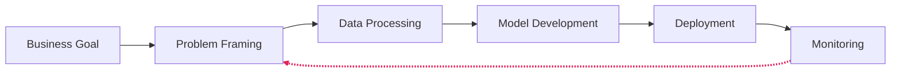
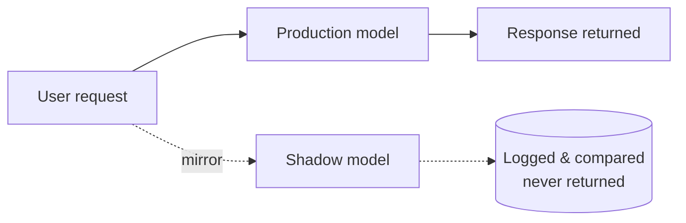
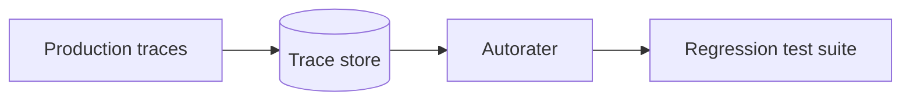
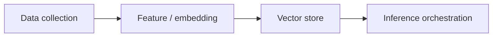
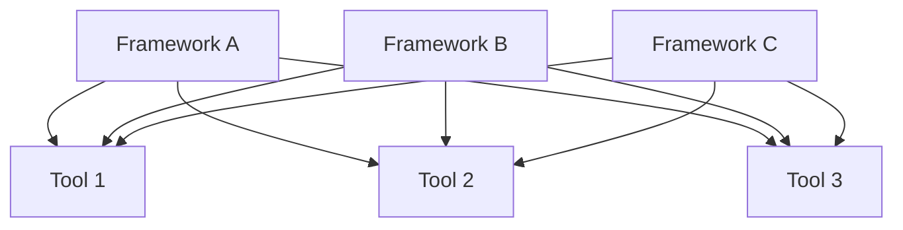
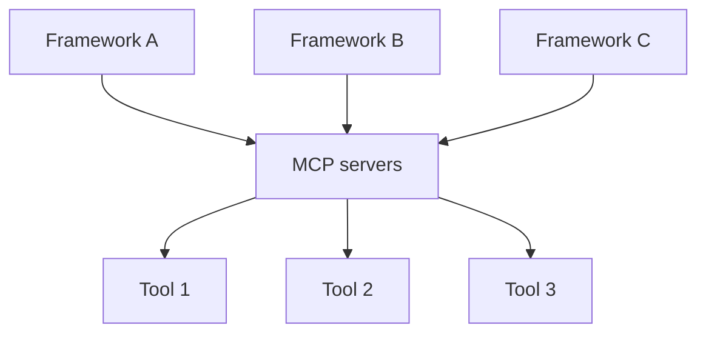

<!--
Hold 15s while people settle. Don't read the title out loud — say hello, thank them for coming.
-->

---
# DELIVERY: Hold 20–30s after the question. Wait for actual hands before continuing.
# ANCHOR: "Yeah. Me too. More than once."
layout: quote
dark: true
---

How many of you have shipped an AI demo that quietly died?

<!--
Ask it slowly, and mean it: "How many of you have built an AI demo that wowed everyone in the room, got the green light from leadership, and then quietly died six months later in a pull request nobody merged?" Pause. Watch hands. Then acknowledge it plainly — "Yeah. Me too. More than once." — before moving on.
-->

---
# DELIVERY: Hold 30s. Say the number slow, then repeat it once. Don't editorialize — the number does the work.
# SOURCE: RAND interviewed 65 experienced data scientists/engineers (5+ years building AI/ML) — qualitative research, not a large-N study. RAND's own language is "by some estimates" — they're citing an external estimate, not a number they computed. If challenged on precision, lead with that honestly: round numbers from real methodology beat fake precision.
layout: stats
stats:
  - value: "80%+"
    label: "of AI projects fail — twice the rate of conventional IT"
    caption: "RAND, 2024. 65 practitioner interviews — citing an outside estimate."
---

<!--
Here's what the data says. RAND interviewed 65 experienced data scientists and engineers with at least five years building AI and ML models. Their conclusion: by some estimates, more than 80 percent of AI projects fail — twice the failure rate of conventional IT projects that don't involve AI. That's RAND citing the estimate, not a number they computed themselves from a huge sample, and it's worth being precise about that on stage. It's qualitative research. What it lacks in decimal precision it makes up for in depth — sixty-five practitioners across company sizes and industries, all converging on the same five root causes.
-->

---
# DELIVERY: Hold 45s. Credibility beat — three independent studies, same conclusion. Read the numbers cleanly, don't editorialize.
# SOURCE: MIT NANDA's "GenAI Divide" report is explicitly preliminary and hasn't been peer-reviewed — flag it if anyone asks. Gartner's 28% is scoped specifically to infrastructure & operations use cases (782 I&O leaders), not enterprise AI broadly — keep that scope precise.
# CUT CANDIDATE: if pacing runs long, cut this slide — slide 3 alone carries the number.
layout: stats
title: "Two more studies"
stats:
  - value: "95%"
    label: "of GenAI pilots show no measurable P&L return"
    caption: "The GenAI Divide. MIT Project NANDA, 2025. Preliminary, not peer-reviewed."
  - value: "28%"
    label: "of AI use cases in infrastructure & operations meet ROI expectations"
    caption: "Gartner, April 2026. 782 I&O leaders."
---

<!--
[click]MIT's Project NANDA dug specifically into generative AI. Their report, "The GenAI Divide," is explicitly preliminary and hasn't been peer-reviewed — worth flagging if anyone asks. Their finding: 95 percent of generative AI pilots deliver no measurable P&L return. Only about 5 percent capture value at scale. [click]Gartner's April 2026 report surveyed 782 infrastructure and operations leaders and found only 28 percent of AI use cases in I&O fully succeed and meet ROI expectations, with 20 percent failing outright. Three independent studies. Same conclusion.
-->

---
# ANCHOR: "The model is 10 percent. The other 90 percent is what killed the project."
layout: comparison
title: "Where the failure actually is"
left:
  title: "The notebook"
  points:
    - "model.fit() converges"
    - "Accuracy looks great on the holdout set"
    - "Demo day: it works"
right:
  title: "The system around it"
  points:
    - "Data pipeline — unowned, undocumented"
    - "Identity boundary — nobody drew it"
    - "Observability — bolted on after the incident"
    - "Cost line — nobody modeled it"
---

<!--
When you actually read the post-mortems, it's almost never the model that failed. The model usually worked fine. What failed was everything around the model — the data pipeline broke, nobody knew when accuracy drifted, costs ballooned past what the business case predicted, security said no the week before launch, or, most commonly, the team lost focus on the original problem three sprints in and never got it back. We've been telling ourselves a story that goes: "the model works in the notebook, so we're 90 percent done." When the model works in the notebook, you are maybe 10 percent done. The other 90 percent is the engineering we've spent thirty years figuring out for every other kind of software, plus some new rules for the parts that are different.
-->

---
# DELIVERY: No decoration — say the line, pause. This is the throughline for everything after.
layout: quote
dark: true
---

AI is software with new rules.

<!--
AI is software. But it's software with rules that break old assumptions. The output is non-deterministic. Behavior changes over time without you touching the code, because the data changed. The cost model is upside down — inference, not compute, is your bill. And regulation isn't optional anymore. Good news, and this is the actual point of the talk: the three major cloud providers, along with an emerging set of open standards, have spent the last few years codifying what works. When you look at AWS, GCP, and Azure side by side today, they've converged — same patterns, same protocols, same models available across all three. That convergence is the signal.
-->

---
# DELIVERY: Walk this briskly — most of the room has seen variations of this diagram. What earns the time is the arrow back into the loop.
# ANCHOR: "This isn't waterfall. It isn't even normal agile. It's a feedback loop with a clock on it."
layout: default
title: "The six-phase lifecycle"
---

# The six-phase lifecycle

<div flex justify-center mt-4>



</div>

<!--
Traditional software has a release. You ship version 1.2, and unless someone changes the code, it behaves the same tomorrow as it does today. AI systems don't work that way — the world changes around your model, your users change, your data distribution shifts. A model that was 94 percent accurate at launch can be 78 percent accurate six months later, and no one touched the code. That single fact reshapes everything. The six phases are business goal identification, ML problem framing, data processing, model development, deployment, monitoring — I'm not going to dwell on each. What I want to highlight is the arrow you don't always see: monitoring back to data processing and problem framing. This isn't waterfall. It isn't even normal agile. It's a feedback loop with a clock on it. The moment you stop iterating, your model starts decaying.
-->

---
# DELIVERY: Hold 30s. Uncomfortable laughs land here. That's the point.
layout: timeline
title: "Use-case drift"
events:
  - date: "Week 1"
    label: "\"Reduce complaints by 30%\""
  - date: "Month 3"
    label: "Which vector database?"
  - date: "Month 6"
    label: "Nobody mentions complaints anymore"
---

<p text-sm opacity-70 mt-8>One of RAND's five root causes: stakeholders miscommunicating the problem</p>


<!--
Phase one, business goal identification, is the phase nobody takes seriously enough. I see teams skip this constantly — they jump to "let's fine-tune a model" before anyone has written down what success looks like. [click]A project starts with "reduce customer complaints by 30 percent." [click]Three months later the team is debating vector database choice and [click]nobody has mentioned complaints in weeks. The original problem disappeared from the agenda. This is one of RAND's five root causes almost verbatim: stakeholders misunderstand or miscommunicate what problem the AI is actually supposed to solve, so the team ships something impressive that nobody asked for.
-->

---
# DELIVERY: Sustainability is worth its own beat — training and inference at scale have real, now-measurable environmental cost.
layout: boxes
title: "Well-Architected, for AI"
boxes:
  - title: Operational Excellence
    detail: MLOps automation
  - title: Security
    detail: Model, data, prompt
  - title: Reliability
    detail: Recovery from drift
  - title: Performance
    detail: Purpose-built silicon
  - title: Cost
    detail: Inference is your bill
  - title: Sustainability
    detail: Measurable now
---

<p text-sm opacity-70 mt-8>AWS ML Lens · GCP AI/ML Framework · Azure Well-Architected AI workload guidance</p>

<!--
Every cloud provider has now published an AI-specific lens on top of their Well-Architected Framework — six pillars: operational excellence, security, reliability, performance efficiency, cost optimization, sustainability. Sustainability is worth a beat. Training and inference at scale have real environmental cost. It's now measurable and reportable.
-->

---
# DELIVERY: Hold 20s. Credibility beat for the entire talk.
# ANCHOR: "When three competitors converge on the same six pillars, that's not marketing. That's emerging engineering truth."
layout: default
title: "Convergence"
---

# Three competitors. Same six answers.

<div grid="~ cols-3 gap-6" mt-8 text-center text-xl>
<div><strong>AWS</strong></div>
<div><strong>GCP</strong></div>
<div><strong>Azure</strong></div>
</div>

<p mt-8 text-center>All three arrived at the same six Well-Architected pillars — independently.</p>

<p text-sm opacity-70 mt-4 text-center>AWS ML Lens · GCP AI/ML Framework · Azure Well-Architected AI workload guidance</p>

<!--
Here's what I find interesting: AWS, GCP, and Azure arrived at these pillars independently. They're documenting the same lessons learned across millions of production AI workloads. When three competitors converge on the same six pillars, that's not coincidence. That's emerging engineering truth.
-->

---
# DELIVERY: Hold. Let it land before moving to the next slide.
layout: quote
dark: true
---

Regulation is an architectural input now. Not a Phase-6 checkbox.

<!--
Here's what's different from a year ago. Regulation used to be a Phase 6 problem — a compliance-team checkbox at the end. That's not true anymore, though the details are more specific than "everything kicks in at once." Your Phase 1 decisions about model choice, data pipelines, and audit logging now have regulatory consequences. Pick accordingly.
-->

---
# DELIVERY: This and slide 44 are the two "new idea" beats worth slowing down for — see the cover's PACING note.
# SOURCE: Article 50 (transparency) carries fines up to €15M/3% of global revenue. The bigger €35M/7% figure is real but is the Act's top tier, reserved for prohibited practices — not the transparency rules that landed August 2. Human-in-the-loop and risk classification got 16 months of runway via the Digital Omnibus (May 2026), to December 2, 2027 — that's more time to build them properly, not a reason to ignore them.
# DELIVERY: Know one real Article 50 enforcement case to reference — check the news in the weeks before delivery.
layout: default
title: "The clock"
---

# The EU AI Act. Two dates, not one.

<div grid="~ cols-2 gap-8" mt-6>
<div>

**August 2, 2026**
- Article 50 transparency obligations
- GPAI penalty powers
- Fines up to €15M or 3% of global revenue

Enforceable <WeeksSince date="2026-08-02" />

</div>
<div>

**December 2, 2027**
- High-risk regime
- Human-in-the-loop checkpoints
- Risk classification, conformity assessment

Delayed 16 months — Digital Omnibus, May 2026

</div>
</div>

<p text-sm opacity-70 mt-8>Source: EU AI Act (Regulation (EU) 2024/1689); Digital Omnibus package, May 2026</p>

<!--
In May 2026, the EU reached a provisional deal called the Digital Omnibus that pushed the high-risk regime — the parts requiring conformity assessment and risk classification — back sixteen months, to December 2027. But August 2, 2026, still mattered: that's when Article 50 transparency obligations became enforceable — AI-generated content labeling, chatbot disclosure, deepfake labeling — and when the Commission gained penalty enforcement power over general-purpose AI providers. Fines for Article 50 violations top out at €15 million or 3 percent of global revenue. The bigger number you may have heard, €35 million or 7 percent, is real, but it's the Act's top tier, reserved for prohibited practices, not the transparency rules that landed that day. Article 50 has been enforceable <WeeksSince date="2026-08-02" /> now — the deadline was real, it was just narrower than the headlines made it sound, and the bigger obligation just moved. Human-in-the-loop checkpoints and formal risk classification got sixteen months of runway via the Digital Omnibus, to December 2027. That's not a reason to ignore them — it's more time to build them properly instead of bolting them on under deadline pressure. Know one real Article 50 enforcement case to reference — check the news the week before you deliver.
-->

---
# CUT CANDIDATE: slide 12 does most of the work — cut this one first if pacing is tight.
layout: default
title: "Standards, not just regulations"
---

# Standards, not just regulations

<div grid="~ cols-3 gap-6" mt-8 text-center text-lg>
<div><strong>EU AI Act</strong></div>
<div><strong>NIST AI RMF</strong></div>
<div><strong>ISO/IEC 42001</strong></div>
</div>

<p mt-8 text-center>Buy, build, or hybrid. Same controls. Same paper trail.</p>

<!--
And it isn't just Europe. NIST AI RMF is the de facto US federal standard. ISO/IEC 42001 is the international AI management system standard. Data lineage tracking is worth doing right now regardless of the exact deadline — it's an architecture decision, not a paperwork exercise. Human-in-the-loop checkpoints and formal risk classification can wait a little longer than we thought a year ago, but "later" isn't the same as "never." Either way, these aren't compliance-team problems anymore. They're Phase 1 architectural decisions — build them in from the start, or retrofitting is nearly impossible.
-->

---
# DELIVERY: Hold 5s. Move on.
layout: section
number: ""
title: "Shipping non-deterministic code"
hide: true
---

<!--
Safe rollout assumes you know what good looks like. Traditional blue-green deployment assumes deterministic behavior — test the new code in green, verify it produces the same outputs as blue, cut over, done. AI breaks that assumption at the foundation. The same input can produce different outputs. "Correct" isn't a value. It's a distribution. So when you roll out a new model, you can't just verify it gives the right answer — you have to verify it gives a reasonable answer most of the time, that it doesn't behave catastrophically in edge cases, and that its performance distribution is acceptable. Fundamentally different validation problem.
-->

---
# ANCHOR (crisp, don't add anything after it): "Correct isn't a value. It's a distribution."
layout: comparison
title: "The core problem"
left:
  title: "A unit test"
  points:
    - "Same input →"
    - "one deterministic output"
    - "Pass or fail"
right:
  title: "The same test, against an LLM"
  points:
    - "Same input →"
    - "three different outputs, three runs"
    - "\"Correct\" isn't pass or fail"
---

<!--
Traditional blue-green deployment assumes deterministic behavior. You test the new code in green, verify it produces the same outputs as blue, cut over. Done. AI breaks that assumption at the foundation. The same input can produce different outputs. Correct isn't a value. It's a distribution.
-->

---
# DELIVERY: Hold 45s. "Read while I narrate" slide — narrate the paragraph below, don't just point at the tiles.
layout: process
title: "Four patterns, one slide"
steps:
  - title: "Blue-Green"
    detail: "Fast rollback, trust your validation"
  - title: "Canary"
    detail: "Gradual, real-user exposure"
  - title: "Shadow"
    detail: "Mirror traffic, discard results"
  - title: "A/B Testing"
    detail: "Prove business impact"
---


<!--
[click]Blue-Green: the classic. Two identical environments, cut over once you trust green. Works fine for AI if you've done your offline validation well and you want fast rollback — but "if you trust your offline validation" is doing a lot of work in that sentence. [click]Canary: you introduce the new model to a small percentage of users and watch what happens. Useful when you want to see real-world behavior but you're confident enough to let some users actually receive the responses. The trick is defining what "watch what happens" means — know what you're measuring before you start. [click]Shadow Deployment: this is the one most teams underuse, and it's the one I want you to take home — more on it next slide. [click]A/B Testing is a different goal entirely. It isn't about technical validation, it's about proving business impact — does the new model actually improve conversion, retention, satisfaction? You only run A/B once you're already confident the model works correctly. Don't confuse this with shadow.
-->

---
layout: default
title: "Shadow deployment, in detail"
---

# Shadow deployment, in detail

<div flex justify-center mt-4>



</div>

- Build 1 — production path only
- Build 2 — shadow duplication added
- Build 3 — comparison and diff, labeled

<!--
Highest-value technical slide of the talk. You deploy the new model alongside the old one. Real production traffic gets mirrored to the new model — same requests, same load. But the new model's responses are never returned to the user. They get logged. You compare distributions, latencies, error rates. You catch the disasters before they touch a single customer. Spend extra time on this. The number of production AI incidents I've seen that would have been caught by a two-week shadow run is depressing. If the venue projector is bad, skip the clicks and present the finished diagram — it's static either way, no risk.
-->

---
# DELIVERY: Say "names change per cloud, shape doesn't" — this pattern is reproducible on AWS and GCP.
layout: process
title: "The Azure template"
steps:
  - title: "Deploy green"
    detail: "0% traffic"
  - title: "Smoke test"
    detail: "Invoke green by name"
  - title: "Mirror"
    detail: "Live traffic duplicated"
  - title: "Progressive shift"
    detail: "10% → 25% → 50% → 100%"
  - title: "Retire blue"
---

<!--
Azure has a particularly clean implementation. [click]Deploy the new version — they call it green — at zero percent traffic. [click]Invoke it directly by name to smoke test. [click]Mirror live traffic. [click]Progressively shift — ten percent, twenty-five, fifty, all of it. [click]At any stage, roll back instantly. This pattern is reproducible on AWS and GCP. Names change. Structure doesn't.
-->

---
# CUT CANDIDATE: nice-to-have callout, not core — see the cover slide's cut-candidate list.
layout: default
title: "Trace-based eval"
---

# Trace-based eval

<div flex justify-center mt-4>



</div>

<p text-sm opacity-70 mt-4>AgentCore Evaluations (GA June 17, 2026, AWS Summit New York) · Foundry trace-based evaluation · Agent Evaluation on Agent Platform</p>

<!--
There's a genuine capability shift worth mentioning. Microsoft, AWS, and GCP now let you grade real production traces from any framework or platform. Foundry has trace-based evaluation across external and hosted agents. AgentCore Evaluations reached GA June 17, 2026, at AWS Summit New York. Agent Platform has Agent Evaluation running against live conversations. Instead of building golden datasets by hand, you're taking your shadow-deployment traces and using them as your eval set. That turns observation into signal automatically. If you haven't looked at this yet, it's worth an afternoon.
-->

---
# ANCHOR (pause between sentences): "Shadow tells you whether the model is broken. Canary tells you whether users tolerate it. You need both answers."
# DELIVERY: alternate framing — this line also works delivered as a full-bleed `layout: quote` (`dark: true`) if you'd rather land it that way instead of on the process steps.
layout: process
title: "The sequence"
steps:
  - title: "Shadow"
    detail: "Tells you whether the model is broken"
  - title: "Canary"
    detail: "Tells you whether users tolerate it"
  - title: "Full cutover"
---

<!--
[click]Shadow, [click]then canary, [click]then full cutover — it's a sequence, not a menu. I've watched teams skip shadow because "we're already running canary." Those are different things solving different problems. Shadow tells you whether the model is broken. Canary tells you whether users tolerate it. You need both answers.
-->

---
# DELIVERY: Section landing line.
layout: quote
---

If shadow isn't in your pipeline, that's your highest-leverage fix.

<!--
Safe rollout assumes you know what good looks like. For generative AI, defining good is harder — which is why we ground these models in retrieved context. Let's talk about how RAG has evolved.
-->

---
layout: section
number: ""
title: "Grounding models in your data"
hide: true
---

---
# CUT CANDIDATE: most of the room already knows why RAG exists — cut this one first in Section IV if time is tight.
layout: default
title: "Why RAG exists"
---

# Why RAG exists

- Foundation models hallucinate
- Foundation models are frozen at training cutoff
- Foundation models don't know your company

<p mt-6 v-click><strong>RAG solves all three.</strong></p>

<!--
Foundation models hallucinate. They're frozen at their training cutoff. They have no idea what's in your company's documents. [click]RAG solves all three problems by retrieving relevant context and injecting it into the prompt before the model generates. Same model. Dramatically better answers.
-->

---
# DELIVERY: Say "same shape everywhere, different plumbing" — the point is the pattern, not the service names.
layout: default
title: "Four pipelines, one shape"
---

# Four pipelines, one shape

<div flex justify-center mt-4>



</div>

| | AWS | GCP | Azure |
|---|---|---|---|
| Collection & storage | S3 | Cloud Storage | Blob Storage |
| Embedding & retrieval | OpenSearch | Vertex AI (Agent Platform) | Azure AI Search |

<!--
Every cloud implements RAG with roughly the same four-pipeline structure. Data collection pipeline pulls raw content into storage. Feature pipeline chunks and embeds it. Vector database stores the embeddings. At runtime, the inference pipeline takes a query, embeds it, finds relevant chunks, and feeds them to the model as context. The services change — S3 plus OpenSearch on AWS, Cloud Storage plus Vertex on GCP, Blob plus AI Search on Azure — but the shape is identical. If you understand the four pipelines, you understand RAG on any cloud.
-->

---
# ANCHOR: "You probably shouldn't be hand-rolling the four-pipeline architecture anymore."
layout: comparison
title: "The managed-knowledge shift"
left:
  title: "2024"
  points:
    - "A dev, staring at the four-pipeline diagram"
    - "Custom code, everywhere"
right:
  title: "2026"
  points:
    - "The same dev"
    - "One box: managed knowledge base"
    - "Bedrock Managed KB (AWS Summit NY, Jun 2026) · Foundry IQ (Build 2026) · GCP RAG Engine"
---

<!--
All three clouds shipped managed knowledge platforms that hide most of the plumbing. Amazon Bedrock's Managed Knowledge Base launched at NY Summit in June — it handles ingestion, parsing, retrieval, and agentic retrieval with native connectors to S3, SharePoint, Confluence, Google Drive. Microsoft's Foundry IQ went GA at Build 2026 as their broader knowledge plane — serverless retrieval, Web IQ for grounded web search, agentic retrieval built in. GCP has the RAG Engine sitting inside the Agent Platform. Implication: you probably shouldn't be hand-rolling the four-pipeline architecture anymore. If you're on greenfield, use the managed offerings. If you're already running custom RAG, evaluate whether the managed offering is now good enough — often it is, and it kills a lot of maintenance burden.
-->

---
layout: comparison
title: "Classic vs. agentic retrieval"
left:
  title: "Classic RAG"
  points:
    - "Query: one vector search"
    - "Sources: one"
    - "Latency: fast"
    - "Cost: cheap"
    - "Best for: FAQ, refunds, policy lookup"
right:
  title: "Agentic retrieval"
  points:
    - "Query: LLM decomposes to sub-queries"
    - "Sources: many, parallel"
    - "Latency: slow"
    - "Cost: expensive"
    - "Best for: complex, multi-source, conversational"
---

<!--
Classic RAG is one query, one vector search, one flattened result, one model call. Fast. Cheap. Works great for FAQ-style questions — "what's our refund policy?" Classic RAG nails that all day. But when the question is "compare our return rates across the last three quarters by product category, and tell me what changed in the supply chain that might explain it," classic RAG falls over. That's agentic retrieval. An LLM decomposes the question into sub-queries, runs them in parallel across multiple sources, and returns a structured response with citations and an activity log. As of today, all three clouds ship this natively.
-->

---
layout: default
title: "The default has flipped"
---

# The default has flipped

In 2026, agentic retrieval ships natively on all three clouds.

Classic RAG is still a good answer more often than teams think.

<p text-sm opacity-70 mt-6>Per each platform's current product docs — Bedrock, Foundry IQ, RAG Engine</p>

<!--
Classic RAG wins on latency and cost. Agentic retrieval wins on complex, conversational, multi-source queries. Pick deliberately. A surprising number of teams default to agentic because it sounds more sophisticated, then wonder why their latency is four seconds and their inference bill tripled. If a single vector search answers your question, do a single vector search. Don't over-engineer.
-->

---
# DELIVERY: Hold. This is the seed for Section VI — don't answer it yet.
layout: quote
dark: true
---

When the agent retrieves, who is it acting as?

<!--
There's one more question agentic retrieval forces you to answer: when the agent goes to retrieve, who is it acting as? We'll come back to that in a few minutes.
-->

---
# DELIVERY: Section landing line.
layout: quote
---

Pick your RAG shape deliberately. Managed unless you have a real reason.

<!--
Once you're decomposing queries, calling tools, and reasoning over results, you're building an agent. And the story of agents in 2026 is really the story of one protocol that reshaped everything.
-->

---
# DELIVERY: Q&A-preemption slide, not from the original v3 script — good natural pause point for a question if the room seems unsure.
layout: comparison
title: "Wait — Doesn't MCP Replace RAG?"
left:
  title: "RAG is a **technique**"
  points:
    - "Chunk documents"
    - "Embed them"
    - "Store in a vector database"
    - "Retrieve relevant chunks at query time"
    - "Inject into the prompt"
right:
  title: "MCP is a **protocol**"
  points:
    - "One server per resource"
    - "Any compliant client can call it"
    - "Works across frameworks and vendors"
    - "Says nothing about retrieval logic itself"
---

<!--
*How does a model get grounded in information it wasn't trained on?*
-->

<!--
*How does an AI app talk to any external tool or data source, the same way, every time?*
-->

**They're not competing.** MCP doesn't replace RAG — it's often how you <em>expose</em> a RAG pipeline to an agent. Your vector search doesn't disappear. It gets wrapped as an MCP server instead of hardcoded into your app.

<!--
This slide exists because someone will ask this question, and it's better to get ahead of it than get caught flat-footed mid-Q&A.
Walk the two columns side by side, in order, don't rush. The audience needs to actually register that these solve different problems before you deliver the punchline at the bottom.
RAG is a pipeline: chunking, embedding, vector search, prompt injection. It solves "the model doesn't know about my data." MCP is a protocol: a standardized way for an AI application to call external tools and data sources. It solves "I don't want to write a custom integration for every tool." Different layers of the stack entirely — this isn't a competition, it's apples and oranges that happen to get used in the same sentence a lot lately.
Land on the callout box: MCP doesn't replace RAG, it's often how you expose a RAG pipeline to an agent. The vector search doesn't disappear when you adopt MCP — it gets wrapped as an MCP server instead of hardcoded into your app. The embedding model, the vector store, the chunking strategy — none of that is MCP's job. MCP is the wire format, not the retrieval logic.
If you want a concrete, current example and have time: Bedrock's Managed Knowledge Base and Foundry IQ, both covered a few slides back, are increasingly exposed AS MCP servers. The agent calls "search_knowledge_base" as one tool among several. That's the honest version of the relationship — convergence, not replacement.
Good natural pause point for a question if the room seems unsure. Better to resolve it here than have it nag at people through the rest of the agent section.
-->

---
# DELIVERY: Densest section of the talk. Do not rush.
layout: section
number: ""
title: "Agents. And the protocol that made them portable."
hide: true
---

<!--
There's a lot of marketing noise around "agents" right now, so let me be precise. A single model with a tool — say, a function that calls a calculator — isn't an agent. That's just a model with a tool. An agent reasons about which tool to use, in what order, evaluates the results, and adapts its next action based on what it observed. The model isn't just generating text. It's making decisions inside a loop.
-->

---
# ANCHOR: "A calculator function bolted to GPT isn't an agent. A loop is."
layout: comparison
title: "What is an agent, actually"
left:
  title: "Model + tool"
  points:
    - "Input → arrow → output"
    - "Not an agent"
right:
  title: "Model in a loop"
  points:
    - "Tools, observations feeding back"
    - "Agent"
---

<!--
A single model with a tool isn't an agent — that's just a model with a tool. An agent reasons about which tool to use, in what order, evaluates the results, and adapts its next action based on what it observed. A calculator function bolted to GPT isn't an agent. A loop is.
-->

---
# DELIVERY: The wall lands all at once — do not click through it. Let the silence sit while they read all five. Then the two payoff lines.
layout: default
title: "New failure modes"
---

# New failure modes

<div flex="~ col" gap-3 text-2xl mt-2>
<div>Infinite loops</div>
<div>Wrong tool called</div>
<div>Hallucinated tool</div>
<div>Correct tool, wrong argument</div>
<div>Correct result, misinterpreted</div>
</div>

<p mt-8 v-click><strong>None of these existed in request/response.</strong></p>

<p mt-3 v-click>Your orchestration pattern decides which of these you fight.</p>

<!--
Once you have a loop, you have new failure modes. The agent can loop forever. It can call the wrong tool. It can hallucinate a tool that was never registered. It can call the right tool with the wrong argument. It can get a correct result back and interpret it incorrectly. Let all five sit on screen before you say anything — the pile-up is the point. Then the two lines: [click]none of this existed in classic request-response AI, and the [click]orchestration pattern you pick is what decides which of these you have to defend against. That sets up the six patterns three slides from here.
-->

---
# DELIVERY: "This is the biggest thing to happen to agents since agents. If you're not familiar with MCP yet, this is the part of the talk to write down."
layout: default
title: "MCP: the setup"
---

# MCP: the setup

<div grid="~ cols-2 gap-8" mt-4>
<div flex="~ col" items-center>

**Before**



</div>
<div flex="~ col" items-center>

**After**



</div>
</div>

<p text-sm opacity-70 mt-4>Model Context Protocol. Anthropic, November 2024. Open standard.</p>

<!--
Anthropic released MCP as an open standard in November 2024. It's a protocol for connecting AI agents to tools and data. Think of it as USB-C for agents — pause after "agents," the metaphor lands better with space around it. Before MCP, every integration between an agent and a tool was custom code. Different agent frameworks meant different integration code. Every vendor's tool ecosystem was walled. What this means architecturally: you can build one MCP server for, say, your internal ticketing system, and it works in Claude Desktop, Cursor, VS Code, AgentCore, Foundry Agent Service, and Agent Platform without changing anything. Tools became portable. That's the shift. Every vendor lock-in argument you used to make about agent frameworks is now weaker than it was a year ago.
-->

---
# ANCHOR: "Tools are portable now. That's the new thing."
# DELIVERY: Read the numbers cleanly, don't editorialize.
layout: stats
title: "MCP: the numbers"
stats:
  - value: "10,000+"
    label: "Public MCP servers"
    caption: "Anthropic's own figure, December 2025"
  - value: "5"
    label: "Vendors (currently) shipping native support"
    caption: "Per each vendor's own product announcements"
  - value: "Dec 2025"
    label: "Donated to Agentic AI Foundation"
    caption: "Anthropic's donation announcement, Dec 2025"
  - value: "July 2026"
    label: "Largest spec revision since launch"
    caption: "Per a third-party MCP version tracker, 2026"
---

<!--
[click]Tools are portable now. That's the new thing. You'll see bigger numbers floating around online — download counts in the tens of millions, Fortune 500 adoption anywhere from 28 to 80 percent depending which blog you land on. Treat those skeptically; nobody's independently measuring this well yet, and the spread between sources tells you that. [click]What's not in dispute is the vendor list and the [click]governance move to the Linux Foundation. [click]That's the real signal.
-->

---
# DELIVERY: Hold 60s. "Read while I narrate" slide — don't walk each tile mechanically, narrate the meta-point once you've covered all six.
layout: boxes
title: "Six orchestration patterns"
boxes:
  - title: "Sequential"
    detail: "Structured pipelines"
  - title: "Routing"
    detail: "Clear category dispatch"
  - title: "Parallel"
    detail: "Latency reduction, diverse perspectives"
  - title: "ReAct"
    detail: "Tool use, iterative"
  - title: "Hierarchical (Magentic)"
    detail: "Open-ended tasks"
  - title: "Evaluator"
    detail: "Quality-critical outputs"
---

<p text-sm opacity-70 mt-4>Magentic-One: Microsoft Research</p>

<!--
Sequential / Prompt Chaining: agents run in a predefined linear order. Predictable, debuggable, limited flexibility — great for structured pipelines. Routing / Handoff: a supervisor agent looks at the input and dispatches to a specialist. The supervisor is your single point of failure — make it small and reliable. Parallel / Concurrent: multiple agents work simultaneously, results get aggregated. Reduces latency for parallel work, gives you diverse perspectives. ReAct — Reason and Act — is the workhorse. The agent thinks, takes an action, observes the result, thinks again. Almost every tool-using agent you've heard of is some flavor of ReAct. Hierarchical / Magentic: a manager agent decomposes an ambiguous task into subtasks and delegates — Microsoft's Magentic-One is one implementation. Don't reach for it unless you need it; the manager adds latency and failure surface. Evaluator / Reflect-Refine: one agent generates, another critiques, loop until quality thresholds are met. Significantly improves output quality, significantly increases cost — use it where quality beats latency.
-->

---
# SOURCE: three conflicts with v3's own script, resolved in favor of the fact-checked version — keep these: AgentCore Evaluations GA is June 17, 2026 (not March, per v3 §III); Foundry Hosted Agents is "targeted for" GA (not confirmed shipped, per v3 §V); AgentCore Payments keeps its "not independently reconfirmed" caveat.
layout: boxes
title: "Runtime landscape, current state"
boxes:
  - title: "AWS AgentCore"
    detail: "GA Oct 2025. Policy, Evaluations, and managed harness all GA June 17, 2026 (AWS Summit NY). Payments (Coinbase, Stripe) announced."
  - title: "GCP Agent Platform"
    detail: "Announced Cloud Next '26. Vertex retired. Skill Registry. Memory Bank profiles GA."
  - title: "Microsoft Foundry"
    detail: "Agent Framework 1.0 GA. Foundry Agent Service GA. Hosted Agents targeted GA early July 2026. M365 publishing."
---

<p text-sm opacity-70 mt-2 text-center>AWS Summit New York, June 2026 · Google Cloud Next '26 · Microsoft Build 2026</p>

<!--
AWS Bedrock AgentCore went GA in October 2025. AgentCore Policy, AgentCore Evaluations, and the managed harness all reached GA at AWS Summit New York on June 17, 2026. It's framework-agnostic — bring your LangGraph, CrewAI, Claude Agent SDK, custom Python. Policies are written in Cedar and run outside your agent code. The managed harness lets you spin up an agent with two API calls, CreateHarness and InvokeHarness, specifying a model, prompt, and tools — no orchestration code needed. AWS has also talked publicly about AgentCore Payments — Coinbase and Stripe integration that would let agents autonomously pay for APIs and services — but double-check the exact GA status closer to your delivery date, since it hasn't been independently reconfirmed. GCP's Gemini Enterprise Agent Platform was announced at Cloud Next in late April 2026. Vertex AI as a standalone product brand was retired — Google was blunt about it: "all Vertex AI services and roadmap evolutions will be delivered exclusively through Agent Platform." Agent Studio for visual design. ADK 2.0 for code-first. Agent Runtime with seven-day execution windows. Skill Registry for tool discovery. Memory Bank profiles now GA. Microsoft Agent Framework 1.0 went GA in April, consolidating Semantic Kernel and AutoGen into one open-source framework. Foundry Agent Service is GA. Hosted agents were a target, not a confirmed shipment, as of Build 2026 — say "targeted for" unless you can confirm the actual GA announcement closer to delivery — with per-session sandboxed compute once it lands. Microsoft now natively supports GitHub Copilot SDK and Claude Agent SDK alongside their own framework, and agents built in Foundry can publish directly to Microsoft 365 Copilot and Teams. Bottom line: all three are GA. Pick on other criteria.
-->

---
layout: default
title: "Cross-vendor reality"
---

# Cross-vendor reality

| Model | AWS | GCP | Azure |
|---|---|---|---|
| Claude | native, Bedrock | available, Model Garden | GA June 29, 2026 |
| GPT | increasingly available | | primary, expanding |
| Gemini | | primary | cross-cloud emerging |
| Open models | everywhere | everywhere | everywhere |

<p mt-6 opacity-80>The frontier models have converged closely on most public benchmarks. The platform gap on governance is the more durable one.</p>

<p text-sm opacity-70 mt-2>Claude on Microsoft Foundry: Microsoft & Anthropic, June 29, 2026</p>

<style>
/* This slide's table has more rows/columns and longer cell phrases than
   the theme's default table density assumes (styles/layout.css only sets
   width/border-collapse — no font-size or padding ceiling). At the base
   size, several cells wrap to two lines, which inflates the table's
   height enough to push both trailing `p` tags below the slide's fixed
   canvas — clipped silently with no scrollbar or console warning, per
   the theme's known "content taller than canvas" failure mode. Shrinking
   font-size and padding together (padding alone barely helps; it's a
   fixed rem value that dominates row height regardless of font-size)
   keeps every cell on one line and the citation clear of the footer. */
table {
  font-size: 0.875rem;
}
th {
  padding: var(--wwt-space-1) var(--wwt-space-3) var(--wwt-space-2);
}
td {
  padding: 0.4rem var(--wwt-space-3);
}
</style>

<!--
Claude went GA on Microsoft Foundry June 29, 2026 — confirmed by Microsoft's own devblog and Anthropic's announcement. Look at what's now true: Claude Opus 4.5, 4.8, and 5 are in GCP's Model Garden. GPT variants are in Azure and increasingly available via Bedrock. LangGraph and CrewAI run on every platform. MCP tools work across all runtimes. The patterns are portable. The models are portable. The tools are portable. So what does that leave? Governance. Identity. Data gravity. Integration with the rest of your stack. That's what actually differentiates the platforms today. If someone tells you to pick a cloud "because it has the best agents," push back — they all have agents. Pick a cloud because its governance and integration model matches your operational reality.
-->

---
# ANCHOR (TOP 5): "In 2026, agents run everywhere. What varies is who they answer to." Hold 20s. No commentary. If you flub any line in the whole deck, don't let it be this one.
layout: quote
dark: true
---

In 2026, agents run everywhere. What varies is who they answer to.

<!--
Once tools, models, and patterns are portable across clouds, the question "which cloud" becomes almost entirely a question about identity, observability, and compliance. Which brings us to the hard part.
-->

---
# CUT CANDIDATE: drop without losing the argument — first cut in Section V if time is tight.
layout: default
title: "A2A + AP2"
---

# A2A + AP2

Two agents, different organizations, talking directly.

- **A2A** — agent-to-agent
- **AP2** — agent payments

Watch this space.

<p text-sm opacity-70 mt-4>A2A and AP2: Google, open protocols</p>

<!--
Just as MCP handles agent-to-tool communication, Google's open Agent-to-Agent protocol handles agent-to-agent communication. Its companion Agent Payments Protocol does what AWS's AgentCore Payments does — enable agent-to-agent commerce. If you're building multi-agent systems that cross organizational boundaries, these are the standards to watch.
-->

---
# DELIVERY: OWASP over-permissioning callout belongs here — lead with it before the two identity patterns.
layout: section
number: ""
title: "The part that determines your platform choice"
hide: true
---

<!--
A traditional application has well-defined endpoints, well-defined permissions, and predictable behavior. An agent has none of those. It executes arbitrary combinations of tools, makes decisions you didn't program, and can bypass application-layer access controls if you let it. OWASP's 2026 agentic security guidance calls out privilege escalation through over-permissioning as the core structural risk. Least-privilege isn't a nice-to-have. It's the only thing standing between you and a very bad day.
-->

---
layout: comparison
title: "The two identity patterns"
left:
  title: "Identity passthrough"
  points:
    - "Microsoft Foundry + Fabric"
    - "User's Entra token flows through the agent"
    - "Agent inherits the human"
right:
  title: "Runtime isolation"
  points:
    - "GCP Agent Identity"
    - "SPIFFE cert bound to container, mTLS everywhere"
    - "Agent has its own identity, tied to where it runs"
---

<!--
Identity Passthrough — Microsoft Foundry plus Fabric. The agent inherits the human user's identity. When the agent goes to query your data lake, it passes through the user's Entra ID token. The data layer enforces permissions exactly as it would for the human. The agent literally cannot see data the user couldn't see. Elegant for human-in-the-loop workflows — the constraint is structural, not policy-based, so you can't accidentally misconfigure it open. Cryptographic Runtime Isolation — GCP's Agent Identity — solves a different problem. What if there's no active human session? What if the agent is running autonomously in the background? You can't pass through an identity that doesn't exist, so GCP uses SPIFFE-based identity, bound to the container runtime lifecycle, with mTLS and certificate-bound tokens. The identity is the agent itself, cryptographically tied to where it's running — if someone steals the token, it doesn't work outside that runtime. Built for autonomous workflows. You'll probably need both. Human-driven assistant? Identity passthrough. Overnight batch agent processing invoices? Runtime isolation. Pick the right one for the use case.
-->

---
layout: code-focus
title: "OpenTelemetry GenAI conventions"
---

```yaml
gen_ai.system: "anthropic"
gen_ai.request.model: "claude-opus-5"
gen_ai.usage.input_tokens: 1834
gen_ai.usage.output_tokens: 412
gen_ai.tool.name: "search_knowledge_base"
gen_ai.server.time_to_first_token: 0.312
```

Datadog · Honeycomb · Grafana · LangChain · CrewAI · AutoGen

**The de facto standard. Not yet formally Stable.**

<p text-sm opacity-70>As of July 2026 — OpenTelemetry GenAI semantic conventions, Development status</p>

<!--
For a long time, agent observability was a mess — every vendor had their own dashboard, their own trace format, their own attribute names. That's changing, though it's worth being precise about how far along it is. No GenAI span, event, metric, or attribute is marked Stable — the conventions moved to their own dedicated repository in 2026 and remain in Development status there, meaning the schema itself is still allowed to change. What is true: broad practical tooling support exists today. That combination — adopt early, expect some churn — is exactly the position most emerging infrastructure standards go through on the way to boring. Practical implication: you can now instrument your agents once and export to any backend. If a platform doesn't emit OTel GenAI conventions, that's a red flag — it means you're locking into their observability stack. Ask the question before you commit.
-->

---
# CUT CANDIDATE: cost is real but well-understood — cut this before slide 12 or the MCP-numbers stats slide.
layout: comparison
title: "Cost reality"
left:
  title: "Traditional compute"
  points:
    - "Mostly flat once provisioned"
right:
  title: "Inference"
  points:
    - "Linear with usage"
    - "No cap"
    - "78% of companies run 2+ LLM families"
    - "3+ jumped from 36% to 59% in one quarter"
    - "— Databricks, State of AI Agents 2026"
---

<!--
The cost model has flipped. Compute used to be your bill. For AI workloads, inference is your bill. And the multi-model reality is now the norm, not the exception. Databricks' State of AI Agents research found 78 percent of companies use two or more LLM families in production, and the share running three or more jumped from 36 to 59 percent in a single quarter last year. GPT variants for one thing, Claude for another, Gemini for something else. Latency-aware routing between cheap and smart models is table stakes — AWS Bedrock has Intelligent Prompt Routing, GCP and Azure have similar primitives. Use them. Quick reality check while we're on cost: if your data lives in S3, the friction of moving it to GCP usually outweighs whatever advantage Gemini gives you. If your analytics already run on BigQuery, fighting that to use SageMaker is going to hurt. Architect for where your data already is — most platform decisions are actually data decisions in disguise.
-->

---
# DELIVERY: sub-text, spoken not shown — the frontier-model convergence claim is directional, not a stat to repeat verbatim (no rigorously sourced number for exactly how close).
layout: quote
dark: true
---

Platform choice matters more than model choice.

<!--
In 2026, platform choice matters more than model choice for most workloads. The frontier models have converged closely on most public benchmarks — I don't have a clean, rigorously sourced number for exactly how close, so take that as directional rather than a stat to repeat verbatim. Platform gaps on governance, compliance, and integration are the ones I'd bet money are larger and more durable. If you're spending months benchmarking models and days on platform decisions, you're probably optimizing the wrong axis. And underneath all of it: data gravity is the unspoken decision driver. Most platform decisions are actually data decisions in disguise.
-->

---
# DELIVERY: Frame the section first — "I promised you a blueprint at the start. Here it is. Not a list of services to adopt. A list of questions to answer before you ship. If you can answer all nine confidently, you're in much better shape than most teams I see." Read them slowly. Let them land.
layout: default
title: "The nine questions"
---

# The nine questions

<div grid="~ cols-2 gap-6" mt-4>
<div flex="~ col" gap-4>
<div flex gap-3><strong style="color: var(--wwt-primary-base)">1.</strong> Are your feedback loops wired from monitoring back to framing?</div>
<div flex gap-3><strong style="color: var(--wwt-primary-base)">2.</strong> Do you have a shadow stage before real users?</div>
<div flex gap-3><strong style="color: var(--wwt-primary-base)">3.</strong> Classic or agentic retrieval — deliberate choice?</div>
<div flex gap-3><strong style="color: var(--wwt-primary-base)">4.</strong> Which orchestration pattern? Can you draw it in 30 seconds?</div>
<div flex gap-3><strong style="color: var(--wwt-primary-base)">5.</strong> Are your tools exposed via MCP?</div>
</div>
<div flex="~ col" gap-4>
<div flex gap-3><strong style="color: var(--wwt-primary-base)">6.</strong> Can your agent ever see data its user can't? Structurally, not policy?</div>
<div flex gap-3><strong style="color: var(--wwt-primary-base)">7.</strong> Are you emitting OpenTelemetry GenAI conventions?</div>
<div flex gap-3><strong style="color: var(--wwt-primary-base)">8.</strong> Article 50 enforceable <WeeksSince date="2026-08-02" /> — are you ready?</div>
<div flex gap-3><strong style="color: var(--wwt-primary-base)">9.</strong> Do you know your per-inference cost and have a routing strategy?</div>
</div>
</div>

<!--
One, lifecycle: are your feedback loops actually wired up? When monitoring detects a problem, does that information make it back to the data and framing phases, or does it die in a dashboard nobody looks at? Two, deployment: do you have a shadow stage before any new model touches real users? If not, that's your highest-leverage fix. Three, retrieval: if you're doing RAG, classic or agentic — did you choose deliberately, or did you default to whatever the tutorial used? Four, orchestration: if you're using agents, which pattern? Can you draw it on a whiteboard in under thirty seconds? If not, it's too complex and you don't fully understand it yet. Five, interoperability: are your tools exposed via MCP, so they work across frameworks and providers, or are they hard-wired into one runtime, one framework, one vendor? MCP portability is the single biggest lock-in insurance policy you can buy right now. Six, identity: can your agent ever see data that its calling user couldn't see? If the answer isn't "structurally, no" — meaning the architecture enforces it, not a policy document — fix that before anything else. Seven, observability: are you emitting OpenTelemetry GenAI semantic conventions? If not, you're locking into a vendor's observability stack — probably a decision you didn't mean to make. Eight, regulation: if you serve European users, and again, most of you do, are you Article 50-ready? That means transparency disclosures and content labeling, specifically. The bigger risk-classification and human-in-the-loop obligations have more runway now, to December 2027, but that's an argument for starting the data lineage work now, not for ignoring it. Nine, cost and portfolio: do you know your per-inference cost? Do you have a routing strategy? Are you locked into one frontier model when the top models have converged closely on most benchmarks, or do you have a diversified portfolio that lets you route by workload? None of these questions are exotic. None require you to invent new patterns. The clouds have already done the hard work of codifying what production AI looks like. Open standards — MCP, A2A, OpenTelemetry GenAI, NIST AI RMF — have codified what portable AI looks like. Regulators have codified what accountable AI looks like. The teams that succeed aren't the ones with the most novel architecture. They're the ones who apply what already works, consistently, with discipline. Hold this slide the whole time you're walking through them — don't advance until you've hit all nine.
-->

---
# DELIVERY: Pause. That's the end. Do not add anything after "start engineering" — not "thanks for coming." Just: "Start engineering. Thank you." Then step back from the mic.
layout: quote
dark: true
---

The engineering already exists.<br>
The standards are here.<br>
The regulators are ready.<br>
Stop dreaming.

<!--
We opened with a question — how many of you have built a demo that died? The reason those demos die isn't that AI is too hard. It's that we treat it like magic when we should be treating it like software. The engineering already exists. It's been written down. The standards are here. The runtimes are GA. The regulators are enforcing. The teams that win from here aren't the ones inventing new patterns — they're the ones applying what's already converged.
-->

---
# DELIVERY: Keep this on screen for the full Q&A. Open with: "I'd love to take questions. What would you like to dig into?"
layout: thank-you
title: "Thank you"
speakers:
  - name: Jeremy Meiss
    socials:
      bluesky: jerdog.dev
      linkedin: /in/jeremy-meiss
      github: jerdog
      website: jmeiss.me
slidesUrl: https://github.com/jerdog/talk-cloud-ai-engineering-patterns
---


<!--
Anticipated questions to be ready for:
- "Which cloud should we pick?" Push to governance model, data gravity, existing stack. Model access is basically at parity now — Claude runs on all three, GPT variants increasingly cross-platform, Gemini available via Model Garden.
- "What about open-source models or self-hosted?" Legitimate path, especially for cost and data sovereignty. Foundry Local, and similar offerings from AWS and GCP, make hybrid architectures easier than they were a year ago.
- "How do you handle prompt injection?" Layered defenses. Model Armor on GCP (now GA for Agent Gateway). Content safety on Azure. Cedar policies on AWS. Plus structural mitigations like identity passthrough. Also, OWASP's 2026 agentic security guidance is worth reading.
- "What about MCP security?" Real concern — RSA researchers flagged this at Conference 2026. MCP servers with broad permissions plus non-deterministic agents create a risk profile enterprises haven't managed before. The 2026-07-28 spec revision improves OAuth alignment, but auth propagation and tool overexposure are still the top-reported issues. Answer: registry, approval, and audit layers before broad write access.
- "How do you handle evaluation?" Trace-based evaluation is the current best answer. All three platforms support grading real production traces from any framework. Golden datasets are still useful for regression testing, but real traces are cheaper and more representative.
- "Is RAG dead now that context windows are huge?" No. Long-context is expensive, slow, and doesn't solve freshness or access-control problems. Managed knowledge bases are the current state of the art.
- "What if I'm not in Europe? Does the EU AI Act matter?" Yes, if you have any European users or process European data. Also, US state-level AI regulations are following the same patterns. The compliance work you do for the EU AI Act is largely reusable.
- "How do I convince my leadership to invest in this?" RAND, MIT NANDA, Gartner all agree. The 80 percent failure rate is real, and it's a leadership problem more than a technical one. Reframe: doing this work is what separates the 20 percent that succeed from the 80 percent that don't.
-->

