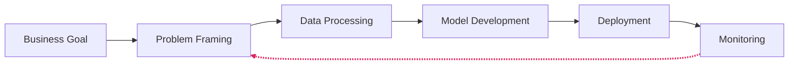
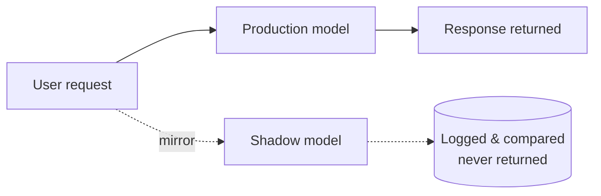
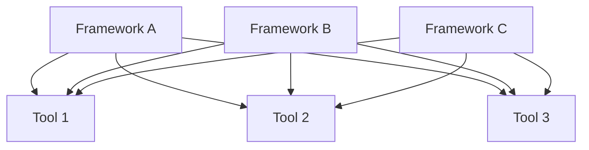
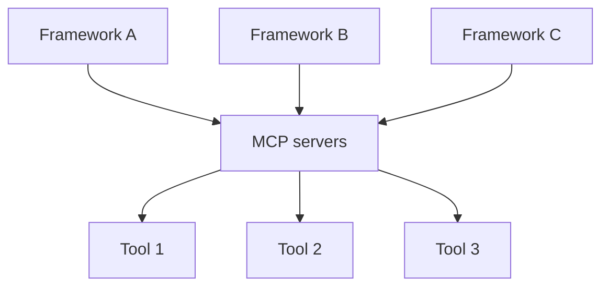

<!--
Hold 15s while people settle. Don't read the title out loud - say hello, thank them for coming.
-->

---
# DELIVERY: Hold 20–30s after the question. Wait for actual hands before continuing.
# ANCHOR: "Yeah. Me too. More than once."
layout: quote
dark: true
---

How many of you have shipped an AI demo, feature, or app that quietly died?

<!--
Ask it slowly, and mean it: "How many of you have built an AI demo that wowed everyone in the room, got the green light from leadership, and then quietly died six months later in a pull request nobody merged?" Pause. Watch hands. Then acknowledge it plainly - "Yeah. Me too. More than once." - before moving on.
-->

---
# DELIVERY: Hold 30s. Say the number slow, then repeat it once. Don't editorialize - the number does the work.
# SOURCE: RAND interviewed 65 experienced data scientists/engineers (5+ years building AI/ML) - qualitative research, not a large-N study. RAND's own language is "by some estimates" - they're citing an external estimate, not a number they computed. If challenged on precision, lead with that honestly: round numbers from real methodology beat fake precision.
layout: default
---

<Stat
  value="80%+"
  label="of AI projects fail - twice the rate of conventional IT"
  caption="RAND, 2024. 65 practitioner interviews - citing an outside estimate."
/>

<!--
Here's what the data says. RAND interviewed 65 experienced data scientists and engineers with at least five years building AI and ML models. Their conclusion: more than 80 percent of AI projects fail - twice the failure rate of conventional IT projects that don't involve AI. That's RAND citing the estimate, not a number they computed themselves from a huge sample. It's qualitative research. What it lacks in decimal precision it makes up for in depth - sixty-five practitioners across company sizes and industries, all converging on the same five root causes.
-->

---
# ANCHOR: "The model is 10 percent. The other 90 percent is what killed the project."
layout: comparison
title: "Where the failure actually is"
left:
  title: "The notebook"
  points:
    - "model.fit() converges"
    - "Accuracy looks great on the holdout set"
    - "Demo day: it works"
right:
  title: "The system around it"
  points:
    - "Data pipeline - unowned, undocumented"
    - "Identity boundary - nobody drew it"
    - "Observability - bolted on after the incident"
    - "Cost line - nobody modeled it"
---

<!--
When you actually read the post-mortems, it's almost never the model that failed. The model usually worked fine. What failed was everything around the model - the data pipeline broke, nobody knew when accuracy drifted, costs ballooned past what the business case predicted, security said no the week before launch, or, most commonly, the team lost focus on the original problem three sprints in and never got it back. We've been telling ourselves a story that goes: "the model works in the notebook, so we're 90 percent done." When the model works in the notebook, you are maybe 10 percent done. The other 90 percent is the engineering we've spent thirty years figuring out for every other kind of software, plus some new rules for the parts that are different.
-->

---
# DELIVERY: No decoration - say the line, pause. This is the throughline for everything after.
layout: quote
dark: true
---

AI is software with new rules.

<!--
AI is software. But it's software with rules that break old assumptions. The output is non-deterministic. Behavior changes over time without you touching the code, because the data changed. The cost model is upside down - inference, not compute, is your bill. And regulation isn't optional anymore. Good news: the three major cloud providers, along with an emerging set of open standards, have spent the last few years codifying what works. When you look at AWS, GCP, and Azure side by side today, they've converged - same patterns, same protocols, same models available across all three. That convergence is the signal.
-->

---
# DELIVERY: Walk this briskly - most of the room has seen variations of this diagram. What earns the time is the arrow back into the loop.
# ANCHOR: "This isn't waterfall. It isn't even normal agile. It's a feedback loop with a clock on it."
layout: default
title: "The six-phase lifecycle"
---

# The six-phase lifecycle

<div flex justify-center mt-4>



</div>

<!--
Traditional software has a release. You ship version 1.2, and unless someone changes the code, it behaves the same tomorrow as it does today. AI systems don't work that way - the world changes around your model, your users change, your data distribution shifts. A model that was 94 percent accurate at launch can be 78 percent accurate six months later, and no one touched the code. That single fact reshapes everything. The six phases are business goal identification, ML problem framing, data processing, model development, deployment, monitoring - I'm not going to dwell on each. What I want to highlight is the arrow you don't always see: monitoring back to data processing and problem framing. This isn't waterfall. It isn't even normal agile. It's a feedback loop with a clock on it. The moment you stop iterating, your model starts decaying.
-->

---
# DELIVERY: Sustainability is worth its own beat - training and inference at scale have real, now-measurable environmental cost.
layout: boxes
title: "Well-Architected, for AI"
boxes:
  - title: Operational Excellence
    detail: MLOps automation
  - title: Security
    detail: Model, data, prompt
  - title: Reliability
    detail: Recovery from drift
  - title: Performance
    detail: Purpose-built silicon
  - title: Cost
    detail: Inference is your bill
  - title: Sustainability
    detail: Measurable now
---

<p mt-6>Three competitors, the same six answers - arrived at independently. That's not marketing. That's emerging engineering truth.</p>

<p text-sm opacity-70 mt-4>AWS ML Lens · GCP AI/ML Framework · Azure Well-Architected AI workload guidance</p>

<!--
Every cloud provider has now published an AI-specific lens on top of their Well-Architected Framework - six pillars: operational excellence, security, reliability, performance efficiency, cost optimization, sustainability. Sustainability is worth a beat - training and inference at scale have real environmental cost, and it's now measurable and reportable. Here's what I find interesting: AWS, GCP, and Azure likely arrived at these pillars independently. They're documenting the same lessons learned across millions of production AI workloads. When three competitors converge on the same six pillars, that's not coincidence. That's emerging engineering truth.
-->

---
# DELIVERY: Hold 5s. Move on.
layout: section
number: ""
title: "Shipping non-deterministic code"
---

<!--
Safe rollout assumes you know what good looks like. Traditional blue-green deployment assumes deterministic behavior - test the new code in green, verify it produces the same outputs as blue, cut over, done. AI breaks that assumption at the foundation. The same input can produce different outputs. "Correct" isn't a value. It's a distribution. So when you roll out a new model, you can't just verify it gives the right answer - you have to verify it gives a reasonable answer most of the time, that it doesn't behave catastrophically in edge cases, and that its performance distribution is acceptable. Fundamentally different validation problem.
-->

---
# ANCHOR (crisp, don't add anything after it): "Correct isn't a value. It's a distribution."
layout: comparison
title: "The core problem"
left:
  title: "A unit test"
  points:
    - "Same input →"
    - "one deterministic output"
    - "Pass or fail"
right:
  title: "The same test, against an LLM"
  points:
    - "Same input →"
    - "three different outputs, three runs"
    - "\"Correct\" isn't pass or fail"
---

<!--
Traditional blue-green deployment assumes deterministic behavior. You test the new code in green, verify it produces the same outputs as blue, cut over. Done. AI breaks that assumption at the foundation. The same input can produce different outputs. Correct isn't a value. It's a distribution.
-->

---
# DELIVERY: Hold 45s. "Read while I narrate" slide - narrate the paragraph below, don't just point at the tiles.
layout: process
title: "Four patterns, one slide"
steps:
  - title: "Blue-Green"
    detail: "Fast rollback, trust your validation"
  - title: "Canary"
    detail: "Gradual, real-user exposure"
  - title: "Shadow"
    detail: "Mirror traffic, discard results"
  - title: "A/B Testing"
    detail: "Prove business impact"
---


<!--
[click]Blue-Green: the classic. Two identical environments, cut over once you trust green. Works fine for AI if you've done your offline validation well and you want fast rollback - but "if you trust your offline validation" is doing a lot of work in that sentence. [click]Canary: you introduce the new model to a small percentage of users and watch what happens. Useful when you want to see real-world behavior but you're confident enough to let some users actually receive the responses. The trick is defining what "watch what happens" means - know what you're measuring before you start. [click]Shadow Deployment: this is the one most teams underuse, and it's the one I want you to take home - more on it next slide. [click]A/B Testing is a different goal entirely. It isn't about technical validation, it's about proving business impact - does the new model actually improve conversion, retention, satisfaction? You only run A/B once you're already confident the model works correctly. Don't confuse this with shadow.
-->

---
layout: default
title: "Shadow deployment, in detail"
---

# Shadow deployment, in detail

<div flex justify-center mt-4>



</div>

- Build 1 - production path only
- Build 2 - shadow duplication added
- Build 3 - comparison and diff, labeled

<!--
Highest-value technical slide of the talk. You deploy the new model alongside the old one. Real production traffic gets mirrored to the new model - same requests, same load. But the new model's responses are never returned to the user. They get logged. You compare distributions, latencies, error rates. You catch the disasters before they touch a single customer. Spend extra time on this. The number of production AI incidents I've seen that would have been caught by a two-week shadow run is depressing. If the venue projector is bad, skip the clicks and present the finished diagram - it's static either way, no risk.
-->

---
# DELIVERY: Say "names change per cloud, shape doesn't" - this pattern is reproducible on AWS and GCP.
layout: process
title: "The Azure template"
steps:
  - title: "Deploy green"
    detail: "0% traffic"
  - title: "Smoke test"
    detail: "Invoke green by name"
  - title: "Mirror"
    detail: "Live traffic duplicated"
  - title: "Progressive shift"
    detail: "10% → 25% → 50% → 100%"
  - title: "Retire blue"
---

<!--
Azure has a particularly clean implementation. [click]Deploy the new version - they call it green - at zero percent traffic. [click]Invoke it directly by name to smoke test. [click]Mirror live traffic. [click]Progressively shift - ten percent, twenty-five, fifty, all of it. [click]At any stage, roll back instantly. This pattern is reproducible on AWS and GCP. Names change. Structure doesn't.
-->

---
# ANCHOR (pause between sentences): "Shadow tells you whether the model is broken. Canary tells you whether users tolerate it. You need both answers."
# DELIVERY: alternate framing - this line also works delivered as a full-bleed `layout: quote` (`dark: true`) if you'd rather land it that way instead of on the process steps.
layout: process
title: "The sequence"
steps:
  - title: "Shadow"
    detail: "Tells you whether the model is broken"
  - title: "Canary"
    detail: "Tells you whether users tolerate it"
  - title: "Full cutover"
---

<!--
[click]Shadow, [click]then canary, [click]then full cutover - it's a sequence, not a menu. I've watched teams skip shadow because "we're already running canary." Those are different things solving different problems. Shadow tells you whether the model is broken. Canary tells you whether users tolerate it. You need both answers.
-->

---
# DELIVERY: Section landing line.
layout: quote
---

If shadow isn't in your pipeline, that's your highest-leverage fix.

<!--
Safe rollout gets one model into production safely. But that's not actually what most teams are shipping in 2026. What they're shipping isn't one model answering one question - it's a loop. A model that decides, acts, observes, and decides again. Let's talk about what that loop is, and the protocol that made it portable.
-->

---
# DELIVERY: Densest section of the talk. Do not rush.
layout: section
number: ""
title: "The protocol that made agents portable"
---

<!--
There's a lot of marketing noise around "agents" right now, so let me be precise. A single model with a tool - say, a function that calls a calculator - isn't an agent. That's just a model with a tool. An agent reasons about which tool to use, in what order, evaluates the results, and adapts its next action based on what it observed. The model isn't just generating text. It's making decisions inside a loop.
-->

---
# ANCHOR: "A calculator function bolted to GPT isn't an agent. A loop is."
layout: comparison
title: "What is an agent, actually"
left:
  title: "Model + tool"
  points:
    - "Input → arrow → output"
    - "Not an agent"
right:
  title: "Model in a loop"
  points:
    - "Tools, observations feeding back"
    - "Agent"
---

<!--
A single model with a tool isn't an agent - that's just a model with a tool. An agent reasons about which tool to use, in what order, evaluates the results, and adapts its next action based on what it observed. A calculator function bolted to GPT isn't an agent. A loop is.
-->

---
# DELIVERY: The wall lands all at once - do not click through it. Let the silence sit while they read all five. Then the two payoff lines.
layout: default
title: "New failure modes"
---

# New failure modes

<div flex="~ col" gap-3 text-2xl mt-2>
<div>Infinite loops</div>
<div>Wrong tool called</div>
<div>Hallucinated tool</div>
<div>Correct tool, wrong argument</div>
<div>Correct result, misinterpreted</div>
</div>

<p mt-8 v-click><strong>None of these existed in request/response.</strong></p>

<p mt-3 v-click>Your orchestration pattern decides which of these you fight.</p>

<!--
Once you have a loop, you have new failure modes. The agent can loop forever. It can call the wrong tool. It can hallucinate a tool that was never registered. It can call the right tool with the wrong argument. It can get a correct result back and interpret it incorrectly. Let all five sit on screen before you say anything - the pile-up is the point. Then the two lines: [click]none of this existed in classic request-response AI, and the [click]orchestration pattern you pick is what decides which of these you have to defend against. That sets up the six patterns three slides from here.
-->

---
# DELIVERY: "This is the biggest thing to happen to agents since agents. If you're not familiar with MCP yet, this is the part of the talk to write down."
layout: default
title: "MCP: the setup"
---

# MCP: the setup

<div grid="~ cols-2 gap-8" mt-4>
<div flex="~ col" items-center>

**Before**



</div>
<div flex="~ col" items-center>

**After**



</div>
</div>

<p text-sm opacity-70 mt-4>Model Context Protocol. Anthropic, November 2024. Open standard.</p>

<!--
Anthropic released MCP as an open standard in November 2024. It's a protocol for connecting AI agents to tools and data. Think of it as USB-C for agents - pause after "agents," the metaphor lands better with space around it. Before MCP, every integration between an agent and a tool was custom code. Different agent frameworks meant different integration code. Every vendor's tool ecosystem was walled. What this means architecturally: you can build one MCP server for, say, your internal ticketing system, and it works in Claude Desktop, Cursor, VS Code, AgentCore, Foundry Agent Service, and Agent Platform without changing anything. Tools became portable. That's the shift. Every vendor lock-in argument you used to make about agent frameworks is now weaker than it was a year ago.
-->

---
# DELIVERY: Hold 60s. "Read while I narrate" slide - don't walk each tile mechanically, narrate the meta-point once you've covered all six.
layout: boxes
title: "Six orchestration patterns"
boxes:
  - title: "Sequential"
    detail: "Structured pipelines"
  - title: "Routing"
    detail: "Clear category dispatch"
  - title: "Parallel"
    detail: "Latency reduction, diverse perspectives"
  - title: "ReAct"
    detail: "Tool use, iterative"
  - title: "Hierarchical (Magentic)"
    detail: "Open-ended tasks"
  - title: "Evaluator"
    detail: "Quality-critical outputs"
---

<p text-sm opacity-70 mt-4>Magentic-One: Microsoft Research</p>

<!--
Sequential / Prompt Chaining: agents run in a predefined linear order. Predictable, debuggable, limited flexibility - great for structured pipelines. Routing / Handoff: a supervisor agent looks at the input and dispatches to a specialist. The supervisor is your single point of failure - make it small and reliable. Parallel / Concurrent: multiple agents work simultaneously, results get aggregated. Reduces latency for parallel work, gives you diverse perspectives. ReAct - Reason and Act - is the workhorse. The agent thinks, takes an action, observes the result, thinks again. Almost every tool-using agent you've heard of is some flavor of ReAct. Hierarchical / Magentic: a manager agent decomposes an ambiguous task into subtasks and delegates - Microsoft's Magentic-One is one implementation. Don't reach for it unless you need it; the manager adds latency and failure surface. Evaluator / Reflect-Refine: one agent generates, another critiques, loop until quality thresholds are met. Significantly improves output quality, significantly increases cost - use it where quality beats latency.
-->

---
# SOURCE: three conflicts with v3's own script, resolved in favor of the fact-checked version - keep these: AgentCore Evaluations GA is June 17, 2026 (not March, per v3 §III); Foundry Hosted Agents is "targeted for" GA (not confirmed shipped, per v3 §V); AgentCore Payments keeps its "not independently reconfirmed" caveat.
layout: boxes
title: "Runtime landscape, current state"
boxes:
  - title: "AWS AgentCore"
    detail: "GA Oct 2025. Policy, Evaluations, and managed harness all GA June 17, 2026 (AWS Summit NY). Payments (Coinbase, Stripe) announced."
  - title: "GCP Agent Platform"
    detail: "Announced Cloud Next '26. Vertex retired. Skill Registry. Memory Bank profiles GA."
  - title: "Microsoft Foundry"
    detail: "Agent Framework 1.0 GA. Foundry Agent Service GA. Hosted Agents targeted GA early July 2026. M365 publishing."
---

<p text-sm opacity-70 mt-2 text-center>AWS Summit New York, June 2026 · Google Cloud Next '26 · Microsoft Build 2026</p>

<!--
All three runtimes are GA - pick on other criteria. AWS Bedrock AgentCore: GA October 2025, framework-agnostic, Cedar policies run outside your agent code, Payments (Coinbase, Stripe) announced but not independently reconfirmed - double-check status before you deliver. GCP Agent Platform: Vertex AI as a standalone brand is retired, everything routes through here now, Memory Bank is GA. Microsoft Foundry: Agent Framework 1.0 GA consolidates Semantic Kernel and AutoGen, Foundry Agent Service is GA, Hosted Agents is "targeted for" GA - say that phrase, not "shipped," unless you've confirmed otherwise closer to delivery.
-->

---
# ANCHOR (TOP 5): "In 2026, agents run everywhere. What varies is who they answer to." Hold 20s. No commentary. If you flub any line in the whole deck, don't let it be this one.
layout: quote
dark: true
---

In 2026, agents run everywhere. What varies is who they answer to.

<!--
The models, the tools, and the orchestration patterns are portable across all three clouds now - that's the throughline of everything we just covered. So the question "which cloud" stops being about capability. It becomes almost entirely a question about identity, observability, and compliance. Which brings us to the hard part.
-->

---
# DELIVERY: OWASP over-permissioning callout belongs here - lead with it before the two identity patterns.
layout: section
number: ""
title: "The part that determines your platform choice"
---

<!--
A traditional application has well-defined endpoints, well-defined permissions, and predictable behavior. An agent has none of those. It executes arbitrary combinations of tools, makes decisions you didn't program, and can bypass application-layer access controls if you let it. OWASP's 2026 agentic security guidance calls out privilege escalation through over-permissioning as the core structural risk. Least-privilege isn't a nice-to-have. It's the only thing standing between you and a very bad day.
-->

---
layout: comparison
title: "The two identity patterns"
left:
  title: "Identity passthrough"
  points:
    - "Microsoft Foundry + Fabric"
    - "User's Entra token flows through the agent"
    - "Agent inherits the human"
right:
  title: "Runtime isolation"
  points:
    - "GCP Agent Identity"
    - "SPIFFE cert bound to container, mTLS everywhere"
    - "Agent has its own identity, tied to where it runs"
---

<!--
Identity Passthrough - Microsoft Foundry plus Fabric. The agent inherits the human user's identity. When the agent goes to query your data lake, it passes through the user's Entra ID token. The data layer enforces permissions exactly as it would for the human. The agent literally cannot see data the user couldn't see. Elegant for human-in-the-loop workflows - the constraint is structural, not policy-based, so you can't accidentally misconfigure it open. Cryptographic Runtime Isolation - GCP's Agent Identity - solves a different problem. What if there's no active human session? What if the agent is running autonomously in the background? You can't pass through an identity that doesn't exist, so GCP uses SPIFFE-based identity, bound to the container runtime lifecycle, with mTLS and certificate-bound tokens. The identity is the agent itself, cryptographically tied to where it's running - if someone steals the token, it doesn't work outside that runtime. Built for autonomous workflows. You'll probably need both. Human-driven assistant? Identity passthrough. Overnight batch agent processing invoices? Runtime isolation. Pick the right one for the use case.
-->

---
layout: code-focus
title: "OpenTelemetry GenAI conventions"
---

```yaml
gen_ai.system: "anthropic"
gen_ai.request.model: "claude-opus-5"
gen_ai.usage.input_tokens: 1834
gen_ai.usage.output_tokens: 412
gen_ai.tool.name: "search_knowledge_base"
gen_ai.server.time_to_first_token: 0.312
```

Datadog · Honeycomb · Grafana · LangChain · CrewAI · AutoGen

**The de facto standard. Not yet formally Stable.**

<p text-sm opacity-70>As of July 2026 - OpenTelemetry GenAI semantic conventions, Development status</p>

<!--
For a long time, agent observability was a mess - every vendor had their own dashboard, their own trace format, their own attribute names. That's changing, though it's worth being precise about how far along it is. No GenAI span, event, metric, or attribute is marked Stable - the conventions moved to their own dedicated repository in 2026 and remain in Development status there, meaning the schema itself is still allowed to change. What is true: broad practical tooling support exists today. That combination - adopt early, expect some churn - is exactly the position most emerging infrastructure standards go through on the way to boring. Practical implication: you can now instrument your agents once and export to any backend. If a platform doesn't emit OTel GenAI conventions, that's a red flag - it means you're locking into their observability stack. Ask the question before you commit.
-->

---
# DELIVERY: sub-text, spoken not shown - the frontier-model convergence claim is directional, not a stat to repeat verbatim (no rigorously sourced number for exactly how close).
layout: quote
dark: true
---

Platform choice matters more than model choice.

<!--
In 2026, platform choice matters more than model choice for most workloads. The frontier models have converged closely on most public benchmarks - I don't have a clean, rigorously sourced number for exactly how close, so take that as directional rather than a stat to repeat verbatim. Platform gaps on governance, compliance, and integration are the ones I'd bet money are larger and more durable. If you're spending months benchmarking models and days on platform decisions, you're probably optimizing the wrong axis. And underneath all of it: data gravity is the unspoken decision driver. Most platform decisions are actually data decisions in disguise.
-->

---
# DELIVERY: Frame the section first - "I promised you a blueprint. Here it is. Not a list of services to adopt. A list of questions to answer before you ship." Narrate five out loud - 1, 2, 4, 5, 6. For the other four, point at the slide and say "three, seven, eight, and nine are in the repo - retrieval shape, observability, EU AI Act readiness, and cost. Happy to go deep on any of them in Q&A." Leave the full nine on screen; it's the takeaway photo.
---

# The nine questions

<div grid="~ cols-2 gap-6" mt-4>
<div flex="~ col" gap-4>
<div flex gap-3><strong style="color: var(--wwt-primary-base)">1.</strong> Are your feedback loops wired from monitoring back to framing?</div>
<div flex gap-3><strong style="color: var(--wwt-primary-base)">2.</strong> Do you have a shadow stage before real users?</div>
<div flex gap-3><strong style="color: var(--wwt-primary-base)">3.</strong> Classic or agentic retrieval - deliberate choice?</div>
<div flex gap-3><strong style="color: var(--wwt-primary-base)">4.</strong> Which orchestration pattern? Can you draw it in 30 seconds?</div>
<div flex gap-3><strong style="color: var(--wwt-primary-base)">5.</strong> Are your tools exposed via MCP?</div>
</div>
<div flex="~ col" gap-4>
<div flex gap-3><strong style="color: var(--wwt-primary-base)">6.</strong> Can your agent ever see data its user can't? Structurally, not policy?</div>
<div flex gap-3><strong style="color: var(--wwt-primary-base)">7.</strong> Are you emitting OpenTelemetry GenAI conventions?</div>
<div flex gap-3><strong style="color: var(--wwt-primary-base)">8.</strong> Article 50 enforceable since 08 Aug 2026 - are you ready?</div>
<div flex gap-3><strong style="color: var(--wwt-primary-base)">9.</strong> Do you know your per-inference cost and have a routing strategy?</div>
</div>
</div>

<!--
One, lifecycle: are your feedback loops actually wired up? When monitoring detects a problem, does that information make it back to the data and framing phases, or does it die in a dashboard nobody looks at? Two, deployment: do you have a shadow stage before any new model touches real users? If not, that's your highest-leverage fix. Four, orchestration: if you're using agents, which pattern? Can you draw it on a whiteboard in under thirty seconds? If not, it's too complex and you don't fully understand it yet. Five, interoperability: are your tools exposed via MCP, so they work across frameworks and providers, or are they hard-wired into one runtime, one framework, one vendor? MCP portability is the single biggest lock-in insurance policy you can buy right now. Six, identity: can your agent ever see data that its calling user couldn't see? If the answer isn't "structurally, no" - meaning the architecture enforces it, not a policy document - fix that before anything else. Three, seven, eight, and nine - retrieval shape, observability conventions, EU AI Act readiness, and per-inference cost - are real and they're on the slide, but they're a talk in themselves. Ask me in Q&A, or find the deep-dive version of this deck linked on the last slide. None of these nine are exotic. None require inventing new patterns. The clouds have already codified what production AI looks like. The teams that succeed aren't the ones with the most novel architecture - they're the ones who apply what already works, consistently, with discipline.
-->

---
# DELIVERY: Pause. That's the end. Do not add anything after "start engineering" - not "thanks for coming." Just: "Start engineering. Thank you." Then step back from the mic.
layout: quote
dark: true
---

The engineering already exists.<br>
The standards are here.<br>
The regulators are ready.<br>
Stop dreaming.

<!--
We opened with a question - how many of you have built a demo that died? The reason those demos die isn't that AI is too hard. It's that we treat it like magic when we should be treating it like software. The engineering already exists. It's been written down. The standards are here. The runtimes are GA. The regulators are enforcing. The teams that win from here aren't the ones inventing new patterns - they're the ones applying what's already converged.
-->

---
# DELIVERY: Keep this on screen for the full Q&A. Open with: "I'd love to take questions. What would you like to dig into?"
layout: thank-you
title: "Thank you"
speakers:
  - name: Jeremy Meiss
    socials:
      bluesky: jerdog.dev
      linkedin: /in/jeremy-meiss
      github: jerdog
      website: jmeiss.me
slidesUrl: https://github.com/jerdog/talk-cloud-ai-engineering-patterns
---


<!--
Anticipated questions to be ready for:
- "Which cloud should we pick?" Push to governance model, data gravity, existing stack. Model access is basically at parity now - Claude runs on all three, GPT variants increasingly cross-platform, Gemini available via Model Garden.
- "What about open-source models or self-hosted?" Legitimate path, especially for cost and data sovereignty. Foundry Local, and similar offerings from AWS and GCP, make hybrid architectures easier than they were a year ago.
- "How do you handle prompt injection?" Layered defenses. Model Armor on GCP (now GA for Agent Gateway). Content safety on Azure. Cedar policies on AWS. Plus structural mitigations like identity passthrough. Also, OWASP's 2026 agentic security guidance is worth reading.
- "What about MCP security?" Real concern - RSA researchers flagged this at Conference 2026. MCP servers with broad permissions plus non-deterministic agents create a risk profile enterprises haven't managed before. The 2026-07-28 spec revision improves OAuth alignment, but auth propagation and tool overexposure are still the top-reported issues. Answer: registry, approval, and audit layers before broad write access.
- "How do you handle evaluation?" Trace-based evaluation is the current best answer. All three platforms support grading real production traces from any framework. Golden datasets are still useful for regression testing, but real traces are cheaper and more representative.
- "Is RAG dead now that context windows are huge?" No. Long-context is expensive, slow, and doesn't solve freshness or access-control problems. Managed knowledge bases are the current state of the art.
- "Doesn't MCP replace RAG?" No - different layers. RAG is a retrieval technique: chunk, embed, store, retrieve, inject into the prompt. MCP is a protocol for calling tools and data sources, and says nothing about retrieval logic itself. In practice they compose: your vector search doesn't disappear, it gets wrapped as an MCP server instead of hardcoded into your app. Bedrock's Managed Knowledge Base and Foundry IQ are increasingly exposed that way.
- "What if I'm not in Europe? Does the EU AI Act matter?" Yes, if you have any European users or process European data. Also, US state-level AI regulations are following the same patterns. The compliance work you do for the EU AI Act is largely reusable. This 20-minute cut skipped the regulation and RAG deep-dives for time - the full 45-minute version, with the EU AI Act timeline, standards landscape, and RAG architecture, is on the `main` branch of the repo linked above.
- "How do I convince my leadership to invest in this?" RAND, MIT NANDA, Gartner all agree. The 80 percent failure rate is real, and it's a leadership problem more than a technical one. Reframe: doing this work is what separates the 20 percent that succeed from the 80 percent that don't.
-->

